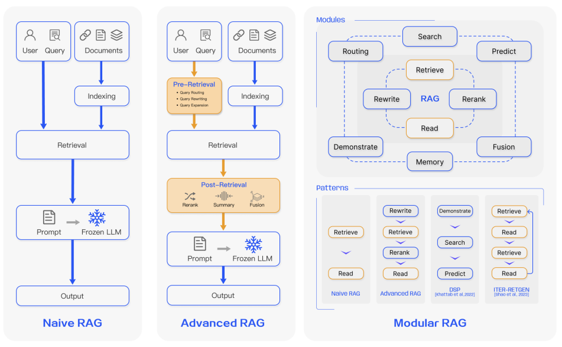

# Agents and LLMs
* how to measure hallucinations?
* how to evaluate outputs against benchmarks?

## Model Families

### Whisper

### GPT
GPT 5

### Gemini

Gemini 3
### Claude

### Llama
Llama3

Llama4

### Qwen

**[Qwen3-VL-Embedding and Qwen3-VL-Reranker](https://qwen.ai/blog?id=qwen3-vl-embedding)**

* Multimodal Versatility: Both models seamlessly handle a wide range of inputs—including text, images, screenshots, and video—within a unified framework. They deliver state-of-the-art performance across diverse multimodal tasks such as image-text retrieval, video-text matching, visual question answering (VQA), and multimodal content clustering.

* Unified Representation Learning (Embedding): By leveraging the Qwen3-VL architecture, the Embedding model generates semantically rich vectors that capture both visual and textual information in a shared space. This facilitates efficient similarity computation and retrieval across different modalities.

* High-Precision Reranking (Reranker): We also introduce the Qwen3-VL-Reranker series to complement the embedding model. The reranker takes a (query, document) pair as input—where both query and document may contain arbitrary single or mixed modalities—and outputs a precise relevance score. In retrieval pipelines, the two models are typically used in tandem: the embedding model performs efficient initial recall, while the reranker refines results in a subsequent re-ranking stage. This two-stage approach significantly boosts retrieval accuracy.

* Inheriting Qwen3-VL’s multilingual capabilities, the series supports over 30 languages, making it ideal for global applications. It is highly practical for real-world scenarios, offering flexible vector dimensions, customizable instructions for specific use cases, and strong performance even with quantized embeddings. 

**[Qwen3-VL](https://qwen.ai/blog?id=99f0335c4ad9ff6153e517418d48535ab6d8afef&from=research.latest-advancements-list)**
* Powerful vision-language model
* can understand and generate text
* understand dynamic videos
* Available in instruct and thinking/reasoning versions

* Visual Agent Capabilities: Qwen3-VL can operate computer and mobile interfaces — recognize GUI elements, understand button functions, call tools, and complete tasks. It achieves top global performance on benchmarks like OS World, and using tools significantly improves its performance on fine-grained perception tasks.
* Superior Text-Centric Performance: Qwen3-VL employs early-stage joint pretraining of text and visual modalities, continuously strengthening its language capabilities.

* Greatly Improved Visual Coding: It can now generate code from images or videos — for example, turning a design mockup into Draw.io, HTML, CSS, or JavaScript code — making “what you see is what you get” visual programming a reality.

* Spatial Understanding: 2D grounding from absolute coordinates to relative coordinates. It can judge object positions, viewpoint changes, and occlusion relationships. It supports 3D grounding, laying the foundation for complex spatial reasoning and embodied AI applications.

* Long Context & Long Video Understanding: All models natively support 256K tokens of context, expandable up to 1 million tokens. 

* Stronger Multimodal Reasoning (Thinking Version): The Thinking model is specially optimized for STEM and math reasoning. When facing complex subject questions, it can notice fine details, break down problems step by step, analyze cause and effect, and give logical, evidence-based answers. It achieves strong performance on reasoning benchmarks like MathVision, MMMU, and MathVista.

* Upgraded Visual Perception & Recognition: By improving the quality and diversity of pre-training data, the model can now recognize a much wider range of objects — from celebrities, anime characters, products, and landmarks, to animals and plants — covering both everyday life and professional “recognize anything” needs.

* Better OCR Across More Languages & Complex Scenes: OCR now supports 32 languages (up from 10), covering more countries and regions. It performs more reliably under challenging real-world conditions like poor lighting, blur, or tilted text. Recognition accuracy for rare characters, ancient scripts, and technical terms has also improved significantly. Its ability to understand long documents and reconstruct fine structures is further enhanced.

### DeepSeek

## Questions

### When to use fine-tuning vs LoRA vs adapters?

* Fine-tuning is suitable when you have a moderate-sized dataset and sufficient computational resources. It allows the model to adapt fully to the new task but can be resource-intensive.
* LoRA is ideal for scenarios with limited computational resources or when you want to quickly adapt a large pre-trained model to a new task. It requires fewer trainable parameters and is faster to train.
* Adapters are useful when you want to maintain the original model's capabilities while adding task-specific knowledge. They are efficient in terms of memory and computation, making them suitable for multi-task learning scenarios.

## LLM Parameters
* **temperature** Temperature controls the randomness of the model's output. Lower values (e.g., 0.2) make the output more deterministic, while higher values (e.g., 0.8) increase randomness and creativity.
* **frequency penalty** Penalizes new tokens based on their existing frequency in the text so far, reducing the likelihood of repetition.
* **presence penalty** Penalizes new tokens based on whether they appear in the text so far, encouraging the model to introduce new topics.
* **top-k** limits the next token selection to the top k most probable tokens, reducing the chance of selecting low-probability tokens.
* **top-p** (nucleus sampling) limits the next token selection to a subset of tokens whose cumulative probability exceeds a threshold p, allowing for dynamic selection based on the distribution.

## LLM-as-a-judge

Cohen's Kappa to measures inter-rater agreement for categorical items, accounting for chance agreement:
$$
K = \frac{P_o - P_e}{1 - P_e}
$$, 
where
  * $P_o$ is the observed agreement proportion
  * $P_e$ is the expected agreement by chance

## Prompt and Context Engineering
* Chris Pott's *BetterTogether* paper showing prompt optimization can match or exceed SFT for specific tasks and *GEPA* for reflective prompt evolution > RL
## RAG
* Indexing and chunking strategies
* Retriever models
    * BM25
    * Dense retrievers (e.g., dual-encoder models like SentenceTransformers, DPR)
    * Hybrid retrievers (BM25 + dense)
* reranker models
    * SentenceTransformers
    * **Cross-encoders.** A reranker typically uses a cross-encoder model, which evaluates a query-document pair and generates a similarity score. This method is more powerful because it allows both the query and the document to provide context for each other. It’s like introducing two people and letting them have a conversation, rather than trying to match them based on separate descriptions.
    * **Dual-encoders.** In contrast, a dual-encoder encodes the query and document separately into fixed-size embeddings and computes similarity (e.g., cosine similarity) between them. This is more efficient for large-scale retrieval but may miss nuanced interactions between the query and document.
    * T5-based rankers
    * ColBERT-based rerankers
* Semantic textual similarity
* Generation
* Multimodal RAG

## Hallucination Detection

* LLM-based judges

* BERTScore
    * BERTScore computes similarity between generated text and reference text using contextual embeddings from BERT. Higher scores indicate better alignment.

* BLEU
    * BLEU measures n-gram overlap between generated text and reference text. It’s precision-focused, so it checks how much of the generated text matches the reference.

* ROUGE
    * ROUGE measures n-gram recall between generated text and reference text. It’s recall-focused, so it checks how much of the reference text is covered by the generated text.

* Fact-based metrics

    * FactCC: A model trained to classify whether a generated statement is factually consistent with a source document.

    * QAGS: Uses question generation and answering to assess factual consistency.

* Farquhar, et al. 2024 Nature paper "Detecting hallucinations in large language models using semantic entropy" *develop new methods grounded in statistics, proposing entropy-based uncertainty estimators for LLMs to detect a subset of hallucinations—confabulations—which are arbitrary and incorrect generations. Our method addresses the fact that one idea can be expressed in many ways by computing uncertainty at the level of meaning rather than specific sequences of words. Our method works across datasets and tasks without a priori knowledge of the task, requires no task-specific data and robustly generalizes to new tasks not seen before.*

    * Generation: Sampling multiple answers from the LLM for a given input.

    * Clustering: Grouping these answers based on semantic equivalence using *bidirectional entailment*, which checks if two answers logically imply each other and share the same meaning $\rightarrow$ *semantic clusters*.
    * Entropy Calculation: Computing the semantic entropy by summing the probabilities of answers within the same semantic cluster. $\rightarrow$ High semantic entropy indicates high uncertainty in the meaning of the generated answers, signaling potential hallucinations.

### Tools and Libraries
* [🤗 TRL](https://🤗.co/docs/trl/index)

## Metrics
* Time to First Token (TTFT)
* Cost per 1K tokens/query
* Answer relevance
* Hallucination rate

## Agents

### Tool Use
* ReAct framework
* Toolformer

### State Management
* Memory-augmented agents
* Long-term memory
* Retrieval-augmented agents

### Planning
* Hierarchical planning
* Task decomposition

### Tools and Libraries
* LangChain
* LlamaIndex
* LangGraph
* Google AgentSDK
* OpenAI Agent Toolkit

## Personalization with LLMs
* User embeddings
* Contextual prompts
* Adaptive response generation

## Evaluation
* log-probability scoring of reference answers
* human evaluation frameworks

## Safety and Ethics
* Toxicity detection
* Bias mitigation

## References
* [Ask in Any Modality: A Comprehensive Survey on Multimodal Retrieval-Augmented Generation](https://arxiv.org/abs/2502.08826)
* https://wandb.ai/site/articles/rag-techniques/
* https://aws.amazon.com/blogs/machine-learning/detect-hallucinations-for-rag-based-systems/
* https://lilianweng.github.io/posts/2021-03-21-lm-toxicity/
* https://huggingface.co/docs/peft/main/en/conceptual_guides/lora
* [Hu et al. (2021) LoRA: Low-Rank Adaptation of Large Language Models](https://arxiv.org/abs/2106.09685)

## Topics
1. Advanced RAG & Information Retrieval
* Hybrid Search: Combining dense (vector) and sparse (keyword/BM25) retrieval using Reciprocal Rank Fusion (RRF).
* GraphRAG: Using knowledge graphs to handle "multi-hop" reasoning (e.g., "How does Company A's policy affect User B's outcome?").
* Reranking: Implementing Cross-Encoders to refine the top-k results before passing them to the LLM.
* Context Distillation: Techniques like LongContextReorder or summarization to ensure the most relevant info is in the "Goldilocks zone" of the context window.

2. Agentic Workflows & System Design
* Planning Algorithms: Understanding ReAct (Reason + Act), Plan-and-Execute, and Chain-of-Thought (CoT).
* Multi-Agent Orchestration: Frameworks like LangGraph or AutoGen for managing state across multiple specialized agents.
* Tool Use (Function Calling): Handling messy API responses, retry logic, and "human-in-the-loop" (HITL) triggers for high-stakes actions.

3. Model Optimization & Deployment (The "Applied" Part)
* Quantization: Techniques like GGUF, AWQ, and EXL2 to run large models on cheaper hardware.
* Speculative Decoding: Using a smaller "draft" model to speed up a larger "target" model.
* vLLM & TGI: Knowledge of high-throughput serving engines.
* Semantic Caching: Storing and retrieving previous LLM responses for similar queries to save costs.

4. Evaluation & LLM-as-a-Judge
* G-Eval and Prometheus: Using advanced models to score smaller models on specific rubrics (fluency, relevance, toxicity).
* DeepEval / RAGAS: Frameworks specifically for testing the "RAG Triad" (Faithfulness, Answer Relevance, Context Precision).
* Unit Testing for AI: Building "golden datasets" and running automated regression tests on prompt changes.

5. Ethics, Governance, and AI Safety
* AI Governance Frameworks: Navigating emerging regulations (like the EU AI Act) and internal "Responsible AI" (RAI) checkpoints.
* Adversarial Testing: Red-teaming models for jailbreaks, prompt injections, and data leakage.
* PII Masking: Implementing automated redaction for sensitive user data within the LLM pipeline.

## Topics v2

Assume **applied AI = product teams using third-party foundation models (API or hosted), with little or no pretraining**, and that the senior DS is accountable for *business outcomes, reliability, and cost*, not model internals.

## 1. Information Retrieval, Memory, and Knowledge Systems

* Index design tradeoffs

  * ANN structures (HNSW, IVF, PQ) and their latency–recall–cost profiles
  * Cold-start vs hot-index behavior
* Freshness & temporal reasoning

  * Time-aware retrieval, recency biasing, snapshot vs streaming indices
* Structured + unstructured fusion

  * When to abandon RAG entirely and issue SQL / graph queries directly
* Failure modes

  * Hallucinations caused by *retrieval mismatch*, not generation
  * Embedding drift over time as the corpus evolves

Key mental model: *RAG is an approximate database with stochastic joins.*

## 2. Agentic Systems, Control, and Reliability

* State management

  * Explicit vs implicit memory
  * Recoverability after partial failure
* Planning under uncertainty

  * When ReAct fails due to compounding error
  * Bounded planning vs open-ended autonomy
* Cost-aware agents
  * Token budgeting as a first-class constraint
  * Early-exit strategies and degraded modes

* Human-in-the-loop design
  * Escalation policies, confidence thresholds, rollback semantics

## 3. Model Choice, Adaptation, and Optimization

*(This is where “applied” actually gets decided.)*

Add these to your deployment section:

* Model selection under constraints
  * Frontier vs mid-tier vs open-weight models
  * Latency, determinism, controllability tradeoffs

* Fine-tuning strategies
  * Instruction tuning vs LoRA vs adapters
  * When fine-tuning hurts generalization

* Prompt engineering as interface design
  * Versioning prompts like APIs
  * Backward compatibility guarantees

* Cost modeling
  * Marginal cost per query
  * Sensitivity to traffic spikes

* Hardware-aware inference
  * GPU vs CPU vs edge tradeoffs
  * Memory bandwidth as the real bottleneck

## Problem Framing & Task Decomposition (Most Underrated Skill)

* Mapping vague product asks (“summarize this”, “classify that”) into:
  * Atomic LLM tasks vs deterministic code
  * One-shot vs multi-step workflows
* Knowing when:
  * Zero-shot is sufficient
  * Few-shot is mandatory
  * You should *not* use an LLM at all
* Decomposing tasks to reduce hallucination surface area
  * Extract → normalize → reason → generate

Key competence: *turning business ambiguity into bounded model work.*

## 2. Prompting as an Interface (Not “Prompt Engineering”)

* Prompt structure patterns
  * Role / task / constraints / examples / output schema
* Determinism controls
  * Temperature, top-p, stop tokens, max tokens
* Schema-first generation
  * JSON mode, function calling, strict validation
* Prompt versioning
  * Backward compatibility and changelogs
* Failure-aware prompting
  * Self-checks, refusal triggers, partial answers

## 3. Light Retrieval & Context Management (Only What You Actually Need)

* When retrieval adds value vs adds noise
* Choosing:
  * Keyword search
  * Vector search
  * Hybrid, only if justified
* Context trimming strategies
  * Top-k tuning
  * Chunk size tradeoffs
* Guarding against:
  * Irrelevant context poisoning outputs
  * Over-reliance on stale documents

## 4. Workflow Orchestration

* Simple, explicit pipelines
  * Step 1: classify
  * Step 2: route
  * Step 3: summarize / extract
* Retry and fallback logic
  * Re-run with stricter prompt
  * Escalate to human
* Timeouts and cost caps
* Human-in-the-loop for edge cases

## 5. Evaluation Without Ground Truth

* Building *task-specific* evaluation sets
  * Small, curated, high-signal
* LLM-assisted evaluation
  * Pairwise ranking over scalar scores
* Proxy metrics
  * Coverage, refusal rate, format validity
* Regression testing
  * Prompt change → output diff
* Qualitative review loops
  * Structured human review, not vibes

## 6. Cost, Latency, and Throughput Awareness

* Token economics
  * Input vs output sensitivity
* Model tiering
  * Cheap model first, expensive model only when needed
* Caching strategies
  * Exact match
  * Semantic cache (sparingly)
* Latency budgeting
  * User-facing vs async tasks

## 8. Deployment & Ops (Thin Slice)

Think: *production hygiene, not distributed systems research.*

* API reliability patterns
  * Retries, backoff, circuit breakers
* Model version pinning
* Rollbacks
* Monitoring:
  * Error rates
  * Output schema violations
  * Latency spikes

