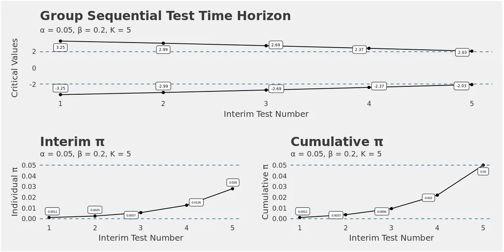
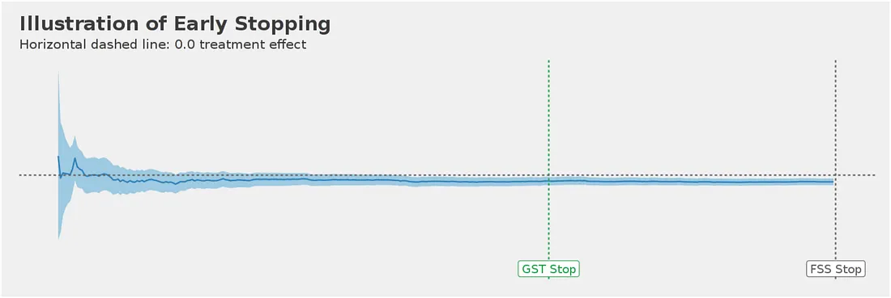
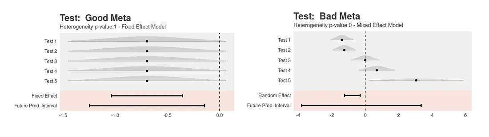
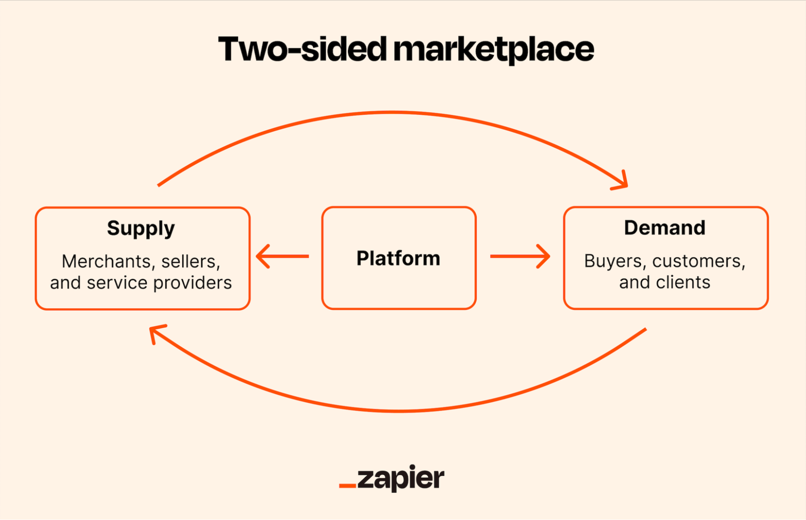
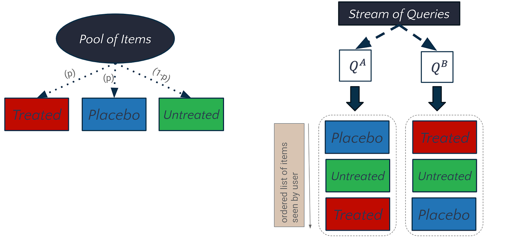
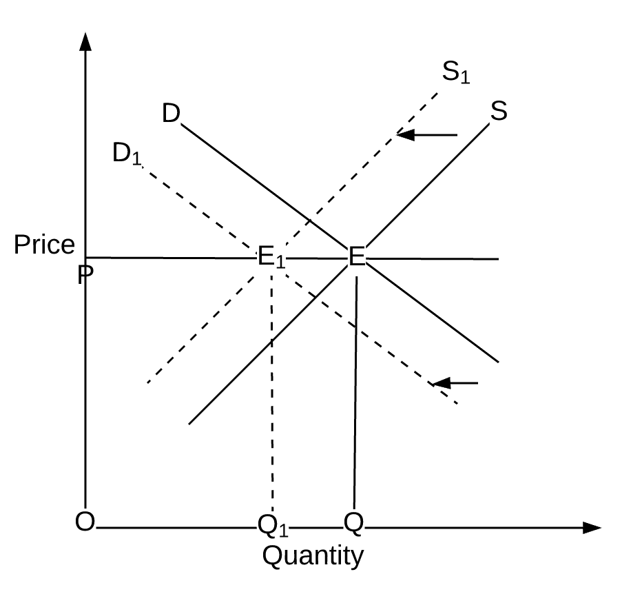

# Experimentation and Causal Inference Notes

Topics beyond Kohavi et al.
* Sequential Testing
* Heterogeneous Treatment Effects
* Bayesian Approaches to A/B Testing
* proxy metrics

## Parameters of Interest
* Average Treatment Effect (ATE)
* Conditional Average Treatment Effect (CATE)
* Average Treatment Effect on the Treated (ATT)
* Average Causal Derivatives
* Local Average Treatment Effect (LATE)
* Global Treatment Effect (GTE): $GTE = Q^{GT} - Q^{GC}$.

## Metrics and Measurement
* **Conversion rates.** Use a $\chi^2$ test for independence instead of a t-test
* **Revenue metrics.** Use log-transform or Box-Cox transform to reduce skewness
* **Time-to-event metrics.** Use survival analysis techniques (e.g. Kaplan-Meier estimator, Cox proportional hazards model)
* **Ratio metrics.** Use delta method or Fieller's theorem to estimate variance

## Sample Ratio Mismatch


## Power

### Simulated Power Analysis

https://docs.scipy.org/doc/scipy/reference/generated/scipy.stats.power.html#scipy.stats.power

The power is simulated as follows:

- Draw many random samples (or sets of samples), each of the size(s) specified by `n_observations`, under the alternative specified by `rvs`.

- For each sample (or set of samples), compute the p-value according to `test`.
These p-values are recorded in the ``pvalues`` attribute of the result object.

- Compute the proportion of p-values that are less than the `significance` level.
This is the power recorded in the ``power`` attribute of the result object.

Suppose that `significance` is an array with shape ``shape1``, 
the elements of `kwargs` and `n_observations` are mutually broadcastable to shape ``shape2``,
and `test` returns an array of p-values of shape ``shape3``. 
Then the result object ``power`` attribute will be of shape ``shape1 + shape2 + shape3``,
and the ``pvalues`` attribute will be of shape ``shape2 + shape3 + (n_resamples,)``.

Suppose we wish to simulate the power of the independent sample t-test
under the following conditions:

- The first sample has 10 observations drawn from a normal distribution with mean 0.
- The second sample has 12 observations drawn from a normal distribution with mean 1.0.
- The threshold on p-values for significance is 0.05.

```python
import numpy as np
from scipy import stats
rng = np.random.default_rng(2549598345528)
>>>
test = stats.ttest_ind
n_observations = (10, 12)
rvs1 = rng.normal
rvs2 = lambda size: rng.normal(loc=1, size=size)
rvs = (rvs1, rvs2)
res = stats.power(test, rvs, n_observations, significance=0.05)
res.power
#0.6116
```

With samples of size 10 and 12, respectively, the power of the t-test
with a significance threshold of 0.05 is approximately 60% under the chosen
alternative. We can investigate the effect of sample size on the power
by passing sample size arrays.

```python
import matplotlib.pyplot as plt
nobs_x = np.arange(5, 21)
nobs_y = nobs_x
n_observations = (nobs_x, nobs_y)
res = stats.power(test, rvs, n_observations, significance=0.05)
ax = plt.subplot()
ax.plot(nobs_x, res.power)
ax.set_xlabel('Sample Size')
ax.set_ylabel('Simulated Power')
ax.set_title('Simulated Power of `ttest_ind` with Equal Sample Sizes')
plt.show()
```

Alternatively, we can investigate the impact that effect size has on the power.
In this case, the effect size is the location of the distribution underlying
the second sample.

```python
n_observations = (10, 12)
loc = np.linspace(0, 1, 20)
rvs2 = lambda size, loc: rng.normal(loc=loc, size=size)
rvs = (rvs1, rvs2)
res = stats.power(test, rvs, n_observations, significance=0.05,
...                   kwargs={'loc': loc})
ax = plt.subplot()
ax.plot(loc, res.power)
ax.set_xlabel('Effect Size')
ax.set_ylabel('Simulated Power')
ax.set_title('Simulated Power of `ttest_ind`, Varying Effect Size')
plt.show()
```

We can also use `power` to estimate the Type I error rate (also referred to by the
ambiguous term "size") of a test and assess whether it matches the nominal level.
For example, the null hypothesis of `jarque_bera` is that the sample was drawn from
a distribution with the same skewness and kurtosis as the normal distribution. To
estimate the Type I error rate, we can consider the null hypothesis to be a true
*alternative* hypothesis and calculate the power.

```python
test = stats.jarque_bera
n_observations = 10
rvs = rng.normal
significance = np.linspace(0.0001, 0.1, 1000)
res = stats.power(test, rvs, n_observations, significance=significance)
size = res.power
```

As shown below, the Type I error rate of the test is far below the nominal level
for such a small sample, as mentioned in its documentation.

```python
ax = plt.subplot()
ax.plot(significance, size)
ax.plot([0, 0.1], [0, 0.1], '--')
ax.set_xlabel('nominal significance level')
ax.set_ylabel('estimated test size (Type I error rate)')
ax.set_title('Estimated test size vs nominal significance level')
ax.set_aspect('equal', 'box')
ax.legend(('`ttest_1samp`', 'ideal test'))
plt.show()
```

As one might expect from such a conservative test, the power is quite low with
respect to some alternatives. For example, the power of the test under the
alternative that the sample was drawn from the Laplace distribution may not
be much greater than the Type I error rate.

```python
rvs = rng.laplace
significance = np.linspace(0.0001, 0.1, 1000)
res = stats.power(test, rvs, n_observations, significance=0.05)
print(res.power)
# 0.0587
```

This is not a mistake in SciPy's implementation; it is simply due to the fact
that the null distribution of the test statistic is derived under the assumption
that the sample size is large (i.e. approaches infinity), and this asymptotic
approximation is not accurate for small samples. In such cases, resampling
and Monte Carlo methods (e.g. `permutation_test`, `goodness_of_fit`,
`monte_carlo_test`) may be more appropriate.


## Multiple Testing

### Bonferroni Correction

Scale the p-value by the number of *independent* tests, $m$.

$$
\alpha_{bonferroni} = \frac{\alpha}{m}
$$

Controls the **Family-Wise Error Rate (FWER)**, the probability of making one or more false discoveries.

Simple, but too conservative (i.e. low power).

Betterr for a small number of tests: $lim_{m \to \infty} \frac{Bonferroni\;Threshold}{\alpha} = 0$ where m is the number of tests.

### Benjamini-Hochberg Procedure

Controls the **False Discovery Rate (FDR)**, the expected proportion of false discoveries among the rejected hypotheses.

Too complex in practice.

Better for a large number of tests. (why?)

### Dunnet's Test
Dunnett's test is a multiple comparison procedure[1] developed by Canadian statistician Charles Dunnett[2] to compare each of a number of treatments with a single control.[3][4] Multiple comparisons to a control are also referred to as many-to-one comparisons.

Unlike the Bonferroni correction, Dunnett’s test is more powerful because it does not treat every pairwise comparison equally, only comparisons to the control group are tested. By accounting for the dependency between hypotheses (since all groups are compared to the control), Dunnett’s correction offers a less conservative approach to controlling the FWER.

Dunnett's method is more complex than the Bonferroni correction, and its core innovation lies in comparing the test statistic to a more stringent critical value than the standard t-distribution. To achieve this, Dunnett developed an adjusted form of the t-distribution, which results in a stricter threshold than the regular distribution, but a more relaxed one compared to the Bonferroni correction.
### Sequential Testing, Peeking, and Optimal Stopping

See literature on "Always Valid Inference"

https://www.youtube.com/watch?v=BanBrr3Hzm8

https://simons.berkeley.edu/talks/always-valid-inference-continuous-monitoring-ab-tests 

https://simons.berkeley.edu/sites/default/files/docs/5572/simonsrj.pdf ([pdf](../readings/simonsrj-always-valid-inference.pdf))


https://www.youtube.com/watch?v=LOhvpOFAlf4


Risks associated with running short experiments:

* Very often tests are allocated much longer than the minimal required time determined by power analysis, to mitigate potential seasonal fluctuations (e.g., time of day, day of week, week over week, etc.), identify any diminishing novelty effect, or account for any treatment effects which may take longer to manifest.
* Holidays and special events, such as new title launches, may attract non-representative audiences. This may render the test results less generalizable.
* Improperly calling experiments early (such as by HARKing or p-hacking) may substantially inflate false positive rates and consequently lead to wasted business effort.

Assuming that a treatment effect is both time-invariant (evaluated by meta-analysis) and sufficiently large, we can apply various optimal-stopping strategies to end tests early. Naively, we could constantly peek at experiment dashboards, but this will inflate false positives when we mistakenly believe a treatment effect is present. There are scientific methodologies to control for false positives (Type I errors) with peeking (or, more formally, interim analyses). Several methods have been assessed in our retrospective study, such as Wald’s Sequential Probability Ratio Tests (SPRT), Sequential Triangular Testing, and Group Sequential Testing (GST).

### Group Sequential Testing (GST)
GST demonstrated the best performance and practical value in our study; it is widely used in clinical trials in which samples are accumulated over time in batches, which is a perfect fit our use case. This is roughly how it works:

* Before a test starts, we decide the minimum required running time and the number of interim analyses.
* GST then allocates the total tolerable Type I error (for example, 0.05) into all interim analyses, such that the total Type I error sums up to the overall Type I error. As a result, each interim test becomes more conservative than regular peeking.
* A test can be stopped immediately whenever it becomes statistically significant. This often happens when the observed treatment effect size is substantially larger than expected.


https://netflixtechblog.com/improving-experimentation-efficiency-at-netflix-with-meta-analysis-and-optimal-stopping-d8ec290ae5be

The following chart illustrates a successful GST early stop and a Fixed Sample Size (FSS full stop) determined by power analysis. Since the observed effect size is sufficiently large, we could stop test earlier with similar point estimates.




### Fisher's Meta-Analysis

Combine p-values from $k$ independent tests of the same hypothesis: $-2 \sum_{i=1}^{k} \ln(p_i) \sim \chi^2_{2k}$, where $p_i$ is the p-value from test $i$.

Can achieve higher power than individual tests.


## Double Machine Learning (DML)

Controls for confounding by residualizing both the treatment and outcome variables with machine learning models. 

DML generalizes to both binary and multi-arm treatments and is particularly robust under non-randomized exposure. (https://causal-machine-learning.github.io/kdd2025-workshop/papers/16.pdf) ***(Why?)***

## Difference-in-Differences (DiD)

Diff-in-diffs explicily controls for systematic differences between treatment and control group that are constant over time.

In diff-in-diff, we usually consider two time periods; pre and post intervention. We utilize the pre-intervention period to generate baselines for our metrics, and normalize post intervention values by the baseline. This normalization is a simple but very powerful way of controlling for inherent differences between treatment and control groups.

## Factorial Designs

### Orthogonal Experiments
Orthogonal experiments refer to experimental designs where multiple factors or treatments are tested simultaneously, and the effects of each factor can be independently estimated without confounding from other factors. In such designs, the levels of one factor are combined with the levels of other factors in a way that allows for clear interpretation of the results.

https://www.statsig.com/perspectives/orthogonal-arrays-design

## CUPED
*Controlled-Experiments Using Pre-Experiment Data*

* CUPED controls for heterogeneity at the individual level that is persistent over time, but not at the treatment assignment level (why?)

* CUPED (pronounced "Q-ped"): Controlled-eperiment Using Pre-Experiment Data for variance reduction. 


## Bandits and Adaptive Experimentation

My YouTube playlist: https://www.youtube.com/playlist?list=PLjN9RcbNfgy6cQQk5sU0w7pLVvWuscNnQ

* Chao Qin, 2024 Columbia Doctoral Thesis [Essays on Adaptive Experimentation: Bringing Real-World Challenges to Multi-Armed Bandits](https://academiccommons.columbia.edu/doi/10.7916/ht74-e058) ([pdf](../readings/Qin_columbia_0054D_18855.pdf))

* https://www.amazon.science/blog/a-general-approach-to-solving-bandit-problems

* [Lessons Learned in Deploying Bandit Algorithms by Kevin Jamieson](https://www.youtube.com/watch?v=RM4oIVd85Nk)

* [Multi-armed Bandits in Production at Stitch Fix](https://www.youtube.com/watch?v=1pTpvHHFaE8)

* [How to implement Gradient Bandit Algorithm | Multi-Armed Bandits Part-5 |AI 😇](https://www.youtube.com/watch?v=tZcXP4MkEP0)

* https://courses.cs.washington.edu/courses/cse599i/18wi/
    * https://courses.cs.washington.edu/courses/cse599i/18wi/resources/lecture10/lecture10.pdf [pdf](./cse599i-lecture10.pdf)

* Lihong Li and Wei Chu et al. A contextual-bandit approach to personalized news article recommendation. In Proceedings of the 19th international conference on World wide web, pages 661–670, 2010. https://arxiv.org/abs/1003.0146

* Ambuj Tewari and Susan A. Murphy. From ads to interventions: Contextual bandits in mobile health. In Mobile Health. Springer, 2017. https://www.ambujtewari.com/research/tewari17ads.pdf [pdf](./tewari%20and%20murphy%20(2017)%20-%20ads.pdf)

* https://static.googleusercontent.com/media/research.google.com/en//pubs/archive/37042.pdf

* https://eugeneyan.com/writing/bandits/

* https://dl.acm.org/doi/10.1145/3240323.3240354

* https://dl.acm.org/doi/10.1145/2959100.2959190

* https://arxiv.org/abs/1809.02130

* Athey et al. [Practitioner’s Guide: Designing Adaptive Experiments](../readings/academic-publication-desiging-adaptive-experiments-2021-mar.pdf)

* Lots of work by [Nathan Kallus](https://nathankallus.com/) and coauthors (e.g. [Simulation-Based Inference for Adaptive Experiments](https://arxiv.org/abs/2506.02881)], [pdf](../readings/2506.02881v1.pdf))

* https://research.netflix.com/publication/post-contextual-bandit-inference

## Balancing Short-Term vs Long-Term Impacts

* Hieararchy of metrics

## User Heterogeneity

* Hot users, warm users, new users


## Detecting Seasonal Effects

### Meta Analysis
While seasonality is perceived to render short tests less generalizable, not all tests should be equally vulnerable. For example, if we experiment on the look and feel of a ‘continue’ button, Monday visitors should not have drastic differences in aesthetic preference compared with Friday visitors. On the other hand, a background image featuring a new original TV series may be more compelling during the time of launch when visitors may have higher awareness and intent to join. The key, then, is to identify the tests with time-invariant treatment effects and run them more efficiently. This requires a mix of technical work and experience.

The secret sauce we used here is meta-analysis, a simple yet powerful method of analyzing related analyses. We adopted this methodology to identify time-varying treatment effects. One frequent application of this method in healthcare is to combine results from independent studies to boost power and improve estimates of treatment effects, such as the efficacy of a new drug. At a high level:

* If outcomes from independent studies are consistent as shown in the following chart (left side), the data can be fitted with a fixed-effect model to generate a more confident estimate. The treatment effect of five individual tests were all statistically insignificant but directionally negative. When pooled together, the model produces a more accurate estimate, as shown in the fixed-effect row.

* By contrast, if outcomes from independent studies are inconsistent, as shown in the right side of the chart, with both positive and negative treatment effects, meta analysis will appropriately acknowledge the higher degree of heterogeneity. It will adjust to a random-effect model to accommodate the wider confidence intervals, as shown in the future prediction interval row.


https://netflixtechblog.com/improving-experimentation-efficiency-at-netflix-with-meta-analysis-and-optimal-stopping-d8ec290ae5be

The model-fitting process (i.e. fixed-effect model versus random-effect model) can be leveraged to test whether heterogeneous treatment effects are present across time dimensions (e.g., time of day, day of week, week over week, pre-/post-event).

## Handling Small Sample Sizes

High variation in outcome metrics combined with small sample size can be a problem to design a well powered experiment using traditional diff-in-diff like approaches. 

Implement designs involving multiple interventions in each unit over an extended period of time whenever possible (i.e. instead of a typical experiment with single intervention period). This can help gather enough evidence to run a well-powered experiment even with a very small sample size (i.e. few geographic units).
Turn the intervention (e.g. advertising) “on” and “off” repeatedly over time in different patterns and geographic units to capture short term effects. Every time we “toggle” the intervention, it gives us another chance to read the effect of the test. So even if we only have few geographic units, we can eventually read a reasonably precise estimate of the effect size


## Interleaving Methods for Online Experiments

* [Innovating Faster on Personalization Algorithms at Netflix Using Interleaving](https://netflixtechblog.com/interleaving-in-online-experiments-at-netflix-a04ee392ec55)

* [DoorDash Experimentation with Interleaving Designs](https://careersatdoordash.com/blog/doordash-experimentation-with-interleaving-designs/)


## Novelty Effect and its Detection in Experiments

## Proxy Metrics

* https://arxiv.org/abs/2309.07893

## Heterogeneous Treatment Effects

* Causal Forests

## Interference and Inference on Networks and $N$-Sided Markets

* Customer-side Randomization
* Market-side Randomization

### "Naive" Horvitz-Thompson Estimator





<!--  -->

The **naive Horvitz–Thompson (HT) estimator** is what you get when you take the classical HT idea—“reweight observations by the inverse of their probability of being observed”—and apply it *without accounting for interference*. In ordinary A/B testing, that omission is harmless. In two-sided marketplaces, it’s usually fatal.

Start with the clean version. The Horvitz–Thompson estimator comes from survey sampling. If unit *i* is included with probability (p_i), you estimate a population total or mean by weighting observed outcomes as (Y_i / p_i). The magic is unbiasedness: unequal sampling doesn’t distort the estimate as long as inclusion probabilities are known.

Now make it “naive.” In a marketplace experiment, suppose you randomize **customers only** (riders, guests, buyers). Each treated customer has probability (p) of receiving the treatment. The naive HT estimator says: take the average outcome among treated customers, divide by (p); do the same for control with (1-p); subtract. Algebraically, this collapses to the usual difference-in-means, just written with HT language. So far, so boring.

The problem is that in marketplaces the outcome for one customer depends on *who else is treated*. This is **interference** or **spillovers**, and it breaks the core assumption behind HT: that each unit’s outcome depends only on its own treatment assignment.

Why this matters in two-sided markets like **Uber** or **Airbnb**:

When you randomize customers only, you change demand but not supply. That causes equilibrium shifts:

* Treated customers may face longer wait times, worse matches, or higher prices because they are competing with other treated customers.
* Control customers are affected too, because supply is partially diverted toward treated customers.

The naive HT estimator implicitly assumes:

* Each customer’s potential outcomes are fixed.
* The probability of being “exposed” to a given market condition equals the probability of being treated.

Both are false. What actually matters is *market-level exposure*: congestion, prices, availability, matching quality. Two treated customers in the same city-hour are not independent samples; they are interacting through the platform.

Concretely, the naive HT estimator answers the wrong question. It estimates something like:

> “What happens when an infinitesimal fraction of customers are treated, holding the rest of the market fixed?”

But the product team usually cares about:

> “What happens if we roll this out to everyone?”

Those are different estimands. In marketplaces, the difference can be large and even flip sign.

Why people still talk about the naive HT estimator:

* It is the natural baseline. If you don’t think about interference, this is what you would do.
* It makes the bias explicit. Once you write the estimator in HT form, you can see exactly where the inclusion probabilities fail to describe true exposure.
* It motivates better designs: cluster randomization, market-level randomization, exposure-aware estimators, or full equilibrium modeling.

The deeper lesson is that “customer-side randomization” is not inherently wrong. It’s just incomplete. Without modeling or controlling for how treatment propagates through supply, prices, and matching, the naive HT estimator is unbiased only for a counterfactual world that the marketplace never actually occupies.

The intellectually honest framing is this: naive HT is correct under SUTVA; two-sided marketplaces violate SUTVA by construction. Everything interesting begins once you accept that and decide how to repair the estimand, the design, or both.


### Exposure Models of Two-Sided Markets

* [Aronow and Samii 2013](../readings/1305.6156v4.pdf)

* [Bajari et al. 2019](../readings/2112.13495v4.pdf)

* [Pouget-Abadie et al. 2020](../readings/variance-reduction-in-bipartite-experiments-through-correlation-clustering-Paper.pdf)

### Structural Models

* [Johari et al. 2022](../readings/2002.05670v5.pdf)

### Switchback Designs

### Spillover Effects

### Clustered Randomized Designs

### Two-Sided Randomization

* See Li, Liskovich, and Weintraub

## Instrumental Variables

## Bayesian Approaches to A/B Testing

## Launch Decisions


## Case Studies and Further Readings
* https://craft.faire.com/how-to-speed-up-your-ab-test-d81cf8b4ae4b

* https://craft.faire.com/how-to-speed-up-your-a-b-test-outlier-capping-and-cuped-8c9df21c76b

* Robbins Sequential Experiments [paper](../readings/robins-sequential-design.pdf)

* Crump et al Overlap [paper](../readings/crump-overlap.pdf)

* Athey and Imbens 2017 JEP [paper](../readings/athey-imbens-2017-jep.pdf)

* https://netflixtechblog.com/recommending-for-long-term-member-satisfaction-at-netflix-ac15cada49ef

* https://netflixtechblog.com/artwork-personalization-c589f074ad76

* https://arxiv.org/abs/1003.0146

* https://booking.ai/how-booking-com-increases-the-power-of-online-experiments-with-cuped-995d186fff1d

* https://www.uber.com/en-BE/blog/causal-inference-at-uber/?uclick_id=92964421-3bf2-497e-989a-b5436cadc193

* https://netflixtechblog.com/netflix-original-research-mit-code-2023-9340b879176a

* https://netflixtechblog.medium.com/return-aware-experimentation-3dd93c94b67a

* https://netflixtechblog.com/sequential-a-b-testing-keeps-the-world-streaming-netflix-part-1-continuous-data-cba6c7ed49df

* https://netflixtechblog.com/causal-machine-learning-for-creative-insights-4b0ce22a8a96

* https://netflixtechblog.medium.com/netflix-at-mit-code-2022-f8407eb0f1df

* https://netflixtechblog.com/a-survey-of-causal-inference-applications-at-netflix-b62d25175e6f

* https://netflixtechblog.com/netflix-at-mit-code-2020-ad3745525218

* https://netflixtechblog.com/building-confidence-in-a-decision-8705834e6fd8

* https://netflixtechblog.com/experimentation-is-a-major-focus-of-data-science-across-netflix-f67923f8e985

* https://www.uber.com/en-BE/blog/mediation-modeling

* [Improving Experimentation Efficiency at Netflix with Meta-Analysis and Optimal Stopping](https://netflixtechblog.com/improving-experimentation-efficiency-at-netflix-with-meta-analysis-and-optimal-stopping-d8ec290ae5be?source=collection_home_page----2615bd06b42e-----20-----------------------------------)

* [Computational Causal Inference at Netflix](https://netflixtechblog.com/computational-causal-inference-at-netflix-293591691c62?source=collection_home_page----2615bd06b42e-----12-----------------------------------)

* [Key Challenges with Quasi-Experiments at Netflix](https://netflixtechblog.com/key-challenges-with-quasi-experiments-at-netflix-89b4f234b852?source=collection_home_page----2615bd06b42e-----9-----------------------------------)

* [Streaming Video Experimentation at Netflix: Visualizing Practical and Statistical Significance](https://netflixtechblog.com/streaming-video-experimentation-at-netflix-visualizing-practical-and-statistical-significance-7117420f4e9a?source=collection_home_page----2615bd06b42e-----19-----------------------------------) 

* [Innovating Faster on Personalization Algorithms at Netflix Using Interleaving](https://netflixtechblog.com/interleaving-in-online-experiments-at-netflix-a04ee392ec55)

* [DoorDash Experimentation with Interleaving Designs](https://careersatdoordash.com/blog/doordash-experimentation-with-interleaving-designs/)

* [Using Contextual Bandit Models in Large Action Spaces at Instacart](https://tech.instacart.com/using-contextual-bandit-models-in-large-action-spaces-at-instacart-cb7ab4d8fa4f)

* [Geo-Based AB Testing and Difference-in-Difference Analysis in Instacart Catalog](https://tech.instacart.com/geo-based-ab-testing-and-difference-in-difference-analysis-in-instacart-catalog-2ba05e744a3f?source=---------2-----------------------)

* [Deep Dive Into Variance Reduction](https://www.microsoft.com/en-us/research/articles/deep-dive-into-variance-reduction/)

* https://www.statsig.com/blog/multiple-comparison-corrections-in-a-b

* https://careersatdoordash.com/blog/addressing-the-challenges-of-sample-ratio-mismatch-in-a-b-testing/

https://careersatdoordash.com/blog/experimentation-analysis-platform-mvp/

https://careersatdoordash.com/blog/improving-experiment-capacity-by-4x/

https://careersatdoordash.com/blog/solving-for-unobserved-data-in-a-regression-model/

https://careersatdoordash.com/blog/google-adwords-campaign-optimization/

https://careersatdoordash.com/blog/experimentation-at-doordash-with-a-multi-armed-bandit-platform/

https://careersatdoordash.com/blog/doordash-ads-uses-budget-a-b-experimentation/

https://careersatdoordash.com/blog/sharpening-the-blur-removing-dilution-to-maximize-experiment-power/

https://careersatdoordash.com/blog/using-metrics-layer-to-standardize-and-scale-experimentation-at-doordash-2/

https://careersatdoordash.com/blog/adapted-switch-back-testing-to-quantify-incrementality-for-app-marketplace-search-ads/

https://careersatdoordash.com/blog/balancing-velocity-and-confidence-in-experimentation/

https://careersatdoordash.com/blog/meet-dash-ab-the-statistics-engine-of-experimentation-at-doordash/

https://careersatdoordash.com/blog/using-back-door-adjustment-causal-analysis-to-measure-pre-post-effects/

https://careersatdoordash.com/blog/the-4-principles-doordash-used-to-increase-its-logistics-experiment-capacity-by-1000/

https://careersatdoordash.com/blog/experiment-faster-and-with-less-effort/

https://careersatdoordash.com/blog/homepage-recommendation-with-exploitation-and-exploration/

https://careersatdoordash.com/blog/using-a-multi-armed-bandit-with-thompson-sampling-to-identify-responsive-dashers/

* [Balancing Network Effects, Learning Effects, and Power in Experiments](https://careersatdoordash.com/blog/balancing-network-effects-learning-effects-and-power-in-experiments/)

* https://developer.squareup.com/blog/lessons-learned-from-running-web-experiments/
