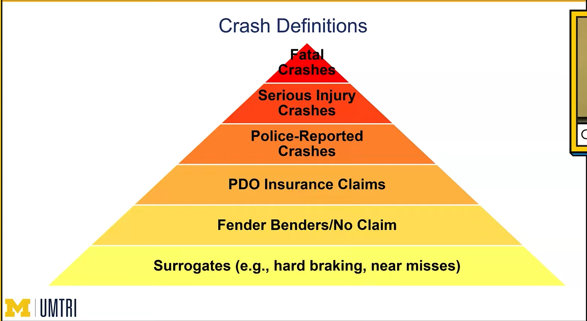
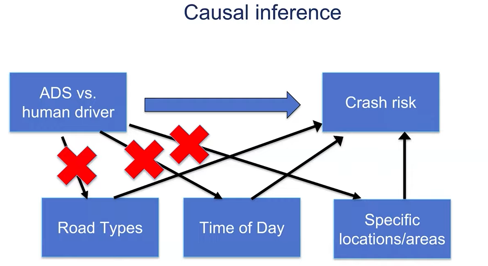

# **Lecture: Safety Benchmarking of Automated Driving Systems**

Carol Flannagan, Research Professor at UM TRI [Safety Benchmarking of Automated Driving Systems: The Challenges of Apples to Apples Comparisons](https://youtu.be/GiMoAG9UUGE?si=AwZWSMCfafhY92oa)  

**Speaker:** Dr. Carol Flannagan, Research Professor, UMTRI; Director, CMISST

**Core Objective:** To explore why comparing ADS safety to human driving is not as simple as a basic ratio and to identify the scientific rigors required for a true "Apples-to-Apples" comparison.

## **II. Defining and Measuring Safety**

Safety is universally described by the **Crash Rate**:

$$\text{Crash Rate} = \frac{\text{Number of Crashes}}{\text{Number of Miles Driven}}$$

**The "Apples-to-Apples" Fairness Problem**

The data collection for the two groups (ADS vs. Human) is fundamentally different, making fair comparisons difficult \[[05:37](http://www.youtube.com/watch?v=GiMoAG9UUGE&t=337)\].

## **III. Four Major Challenges to Fair Comparison**

### 1. Measuring Crashes (The Numerator) in the same way

ADS Data
* Captured by precision sensors measuring forces, contacts, and accelerations (Delta-V). 
* It is objective and measured *during* the event \[[06:04](http://www.youtube.com/watch?v=GiMoAG9UUGE&t=364)\].  

Human crashes
* **Police Reports** 
* **Insurance Claims**. These involve human decisions: "Do I call the police?" and "Does this meet the state's reporting threshold?" \[[07:18](http://www.youtube.com/watch?v=GiMoAG9UUGE&t=438)\].  
* Event data recorder (EDR)
* Naturalistic driving studies (NDS)

**Gap:** Mapping sensor data (e.g., a 5G pulse) to a subjective police report is extremely difficult \[[08:15](http://www.youtube.com/watch?v=GiMoAG9UUGE&t=495)\].

### 2. Measuring Miles (the denominator) in the same way

ADS crash data
* Odometer and complete capture route history
* Specific ODDs may be restricted by
  * time of day
  * weather
  * road type and condition

Human crash data
* VMT is estimated and aggregated to
  * broad road class
  * broad vehicle type
  * Are(county, city, etc.)
* NDS uses complete capture of routes and/or odometer

### 3. Choosing the Comparison Population

**Which human drivers are we comparing to?**
* **Average vs. Careful, Competent Driver** Should an ADS be compared to the *average* driver (including the impaired and distracted) or a *careful, competent* driver?

**What travel will the ADS replace?**
* **Replacement Context:** If an ADS is used for ride-sharing, it should be compared to professional ride-share drivers. If it's used for the disabled who currently use buses, it should be compared to professional transit drivers.

### 4. The "Too Few Miles" Problem

* **The Heinrich/L. Triangle:** Severe events (fatalities) are rare. To statistically prove an ADS is safer than a human regarding fatalities, you need **billions of miles**

* **Uncertainty:** ADS companies currently have too few miles to make precise claims about serious injury or fatal crash rates.

## What Has Been Done?

### police report data most used, biggest sample

Pros
* large sample size
* wide (or useful) geographic coverage
* crash detail including location

Cons
* objective (replicaable) crash definition
* mileage data for study pop

## Insurance claim data

Pros
* large sample size
* wide (or useful) geographic coverage

Cons
* objective (replicaable) crash definition
* mileage data for study pop
* no crash detail including location (use insured person's home address)

## Naturalistic driving studies

Pros
* crash detail including location
* mileage data for study pop
* objective (replicaable) crash definition
* geographic filtering of mileage possible

Cons
* Not a wide or useful geographic coverage
* not a large sample size

## The Ideal: The Randomized Controlled Trial (RCT)

* A scientist recruits participants and flips a coin: Heads \= You drive; Tails \= The ADS drives you. 
* Both drive the same route, 
* at the same time of day/day of week
* same defn of crashes identified in the same way
* choose human drivers from comparison pool
* run enough trips and miles to observe (enough) crashes (for statistical power)

* road types are not equal and confound comparison of ADS vs human drivers estimates of crash rates, DAG:

Gaps between ideal and reality
* matching crash definitions
* matching trips, roads, or even ODD
* matching time/day
* selecting replacement drivers
* insufficient miles to observe bad outcomes (especially high severity outcomes like fatalities)

## Recommendations and Ways Forward

### Recommendation 1: Improve Human-Driver Crash Data

Available VMT datasets are too highly aggregated but could be improved with
* road-segment-level detail on traffic volumes
* road-segment- or area-level travel patterns by day of week/month/time of day

Improve police report data:
* Adding vehicle damage and 
* travel purpose (ride-share vs. personal) to police reports (HARD!)

### Recommendation 2: Purpose-Built Studies

Flannagan, et al. (2023). *Establishing a Crash Rate Benchmark Using Large-Scale Naturalistic Human Ridehail Data.* UMTRI. https://deepblue.lib.umich.edu/items/8d794142-7028-45ab-ad3b-faf2b3691437

**The Cruise/Maven Study:** 
* A collaboration between GM Cruise, UMTRI, and VTTI. They studied ride-share drivers specifically in the Cruise Operating Design Domain (ODD) using telematics (OnStar)
* included very minor crashes (5mph delta-v)

* found human crash rates in San Francisco were 4-5x higher than general police-report estimates when including minor crashes.

Nielsen's of Driving

### Recommendation 3: Use Safety Surrogates

* Small samples of miles mean that assessments of injury-crash rates will have high uncertainty. But "wait for more miles" is not a strategy.

* **Aviation Model:** Follow the **ASIAS** (Aviation Safety Information Analysis and Sharing) model, where the industry tracks undesirable states (because the crash rate is too low to observe) to prevent rare catastrophes.

* hard-braking is not a bad state *per se* it is a predictor, do you really want people to stop braking hard when it is needed?

* **Undesirable States:** Instead of waiting for a crash, measure "near-misses" like **Time to Collision (TTC)**. Thinking is less about how a surrogate *predicts* risk and more about solving small problems that can become big problems.

### Recommendation 4: Don't let the perfect be the enemy of the good

* current data systems are imperfect (but not useless) comparisons 

## **Referenced Research & Entity Bibliography**

1. **RAND Report (2016):** *Driving to Safety: How Many Miles of Driving Would It Take to Demonstrate Autonomous Vehicle Reliability?*

2. **Scanlon et al. (2021/2023):** Research on Maricopa County (Phoenix) benchmarks for human driving 

3. **Flannagan, C., et al. (2023):** *Establishing a Crash Rate Benchmark Using Large-Scale Naturalistic Human Rider Data.* (UMTRI/GM Cruise Study)

4. **SHRP2 (Strategic Highway Research Program):** The largest naturalistic driving study, used for benchmarking human behavior

5. **ASIAS:** Federal Aviation Administration data-sharing program for safety surrogates