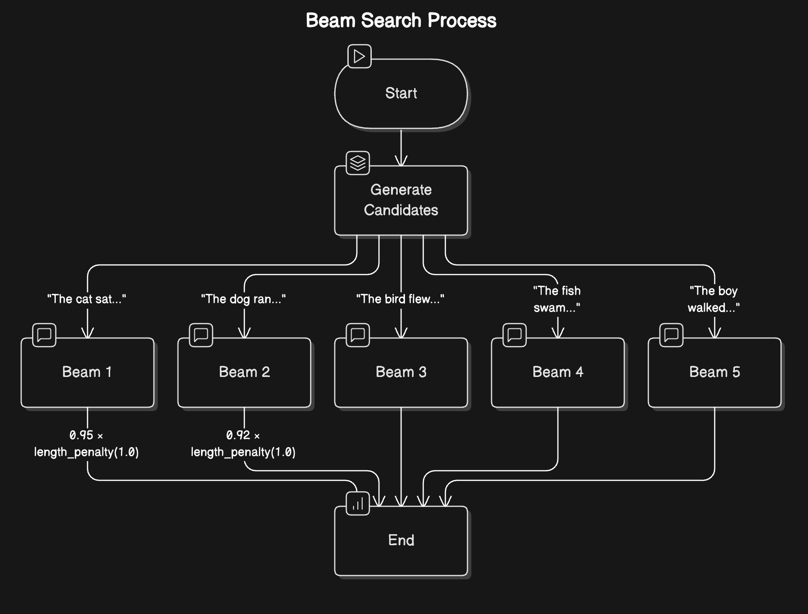
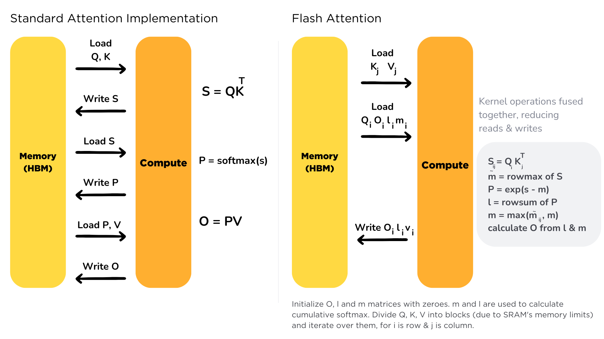

# Deployment & Inference Optimization

## How Inference Works

how LLMs actually generate text. The process can be broken down into two main phases: prefill and decode. These phases work together like an assembly line, each playing a crucial role in producing coherent text.

### Prefill phase is like the preparation stage in cooking - it’s where all the initial ingredients are processed and made ready.

* Tokenization: Converting the input text into tokens (think of these as the basic building blocks the model understands)

* Embedding Conversion: Transforming these tokens into numerical representations that capture their meaning

* Initial Processing: Running these embeddings through the model’s neural networks to create a rich understanding of the context

This phase is computationally intensive because it needs to process all input tokens at once.

### The Decode Phase. The model generates one token at a time in what we call an autoregressive process (where each new token depends on all previous tokens).

* Attention Computation: Looking back at all previous tokens to understand context

* Probability Calculation: Determining the likelihood of each possible next token

* Token Selection: Choosing the next token based on these probabilities

* Continuation Check: Deciding whether to continue or stop generation

This phase is memory-intensive because the model needs to keep track of all previously generated tokens and their relationships.

### Managing Repetition

One common challenge with LLMs is their tendency to repeat themselves - much like a speaker who keeps returning to the same points. To address this, we use two types of penalties:

* Presence Penalty: A fixed penalty applied to any token that has appeared before, regardless of how often. This helps prevent the model from reusing the same words.

* Frequency Penalty: A scaling penalty that increases based on how often a token has been used. The more a word appears, the less likely it is to be chosen again.

These penalties are applied early in the token selection process, adjusting the raw probabilities before other sampling strategies are applied. Think of them as gentle nudges encouraging the model to explore new vocabulary.

### Temperature Control

Like a creativity dial - higher settings (>1.0) make choices more random and creative, lower settings (<1.0) make them more focused and deterministic. This is done by scaling the logits (raw scores) before applying the softmax function to get probabilities:
$$
P(x_i) = \frac{e^{(p_i / \tau)}}{\sum_{j} e^{(p_j / \tau)}}
$$
Where $p_i$ is the logit for token $i$ and $\tau$ is the temperature. A higher temperature flattens the distribution, making less likely tokens more probable, while a lower temperature sharpens it, favoring the most likely tokens.

### Filtering Strategies

* **Top-p (Nucleus) Sampling:** Instead of considering all possible words, we only look at the most likely ones that add up to our chosen probability threshold (e.g., top 90%)

*OR*

* **Top-k Filtering:** An alternative approach where we only consider the k most likely next words

### Controlling Generation Length

* Token Limits: Setting minimum and maximum token counts

* Stop Sequences: Defining specific patterns that signal the end of generation

* End-of-Sequence Detection: Letting the model naturally conclude its response

For example, if we want to generate a single paragraph, we might set a maximum of 100 tokens and use “\n\n” as a stop sequence.

### Beam Search

While the strategies we’ve discussed so far make decisions one token at a time, beam search takes a more holistic approach. Instead of committing to a single choice at each step, it explores multiple possible paths simultaneously - like a chess player thinking several moves ahead.
1. At each step, maintain multiple candidate sequences (typically 5-10)
2. For each candidate, compute probabilities for the next token
3. Keep only the most promising combinations of sequences and next tokens
4. Continue this process until reaching the desired length or stop condition
5. Select the sequence with the highest overall probability

### Speculative Decoding
Speculative decoding is an advanced technique that speeds up the token generation process by using a smaller,

## Quantization – int8/bfloat16 inference.

In general, **quantization** is one of the most effective ways to optimize LLMs for **inference**.

While QLoRA uses quantization as a "hack" to save memory during training, general quantization (like GPTQ, AWQ, or GGUF) is designed to make a model run faster and fit on smaller hardware once the training is finished.

Here is how it specifically helps with inference:

### 1. Breaking the "Memory Wall" (Bandwidth)

The biggest bottleneck in LLM inference isn't actually your GPU's processing speed—it’s **Memory Bandwidth**.

* **The Problem:** During inference, the GPU spends most of its time waiting for weights to move from the slow VRAM into the fast on-chip memory (SRAM) to do the math.
* **The Solution:** If you quantize a model from 16-bit to 4-bit, you are moving **4x less data**. This means the GPU can load the necessary weights four times faster, directly resulting in a massive boost in **Tokens Per Second (TPS)**.

### 2. KV Cache Compression (Throughput)

Inference requires a "Key-Value (KV) Cache" to remember the context of the conversation.

* As the conversation gets longer, this cache grows and eats up VRAM.
* Quantizing the KV cache allows you to store more "history" in the same amount of memory.
* This improves **throughput**, allowing a single GPU to handle many more simultaneous users or much longer documents without running out of memory.

### 3. Hardware Acceleration

Modern AI chips (like NVIDIA’s Tensor Cores) have specialized "lanes" for low-precision math.

* **FP16/FP32:** High-precision math that is numerically "heavy."
* **INT8/INT4:** Integer math that is significantly "lighter" and faster.
By using quantization, you tap into these specialized hardware units that can perform multiple integer operations in the same amount of time it takes to do one floating-point operation.

### Summary of Inference Gains

| Benefit | How Quantization Achieves It |
| --- | --- |
| **Lower Latency** | Less data moved from VRAM = faster token generation. |
| **Higher Throughput** | Smaller weights + smaller KV cache = more concurrent users. |
| **Smaller Footprint** | Reduces a 140GB model to 35GB, fitting a "huge" model on a single consumer GPU. |
| **Energy Efficiency** | Moving less data and using simpler math consumes significantly less power. |

### Popular "Inference-First" Quantization Formats

If you are looking to run models locally, you’ll likely encounter these:

* **GGUF (Llama.cpp):** Best for CPU + GPU "split" inference (Macs and PCs).
* **GPTQ / AWQ:** Best for pure GPU inference; extremely fast and accurate.
* **EXL2:** Optimized specifically for high-speed inference on NVIDIA consumer cards.

<!-- ## Pruning – structured vs unstructured. -->

## Knowledge distillation – student-teacher training.

From Hinton's 2014, "Dark Knowledge" paper. Key memes: want to tell the model when a `cow` is sort of like a `horse`, not just that it's not a `dog`; let the model know that there is a space of numbers sort of like `7` and sort of like `8` without ever seeing `[0,1,2,3,4,5,6,9]`. Going from hard labels to soft labels regularizes the model and improves generalization.

* Knowledge distillation transfers knowledge from a large "teacher" model to a smaller "student" model by training the student to mimic the teacher's outputs.

* Uses **soft labels** (probability distributions) from the teacher to provide richer training signals than hard labels. Modulate the soft labels with a temperature parameter to control the smoothness of the distribution.

* Training involves minimizing the difference between the student's and teacher's output distributions, often using Kullback-Leibler (KL) divergence as the loss function.

*Get near the performance of a large ensemble of models with a single smaller model!*

## Batching strategies for inference – microbatching, dynamic batching for latency-sensitive endpoints

Batching is the primary lever for moving LLM inference from a **memory-bound** state to a **compute-bound** state, which significantly increases throughput but introduces a delicate trade-off with latency.

Here is a technical breakdown of how batching influences efficiency:

---

### 1. The Core Bottleneck: Arithmetic Intensity

LLM inference is famously "memory-bound" during the **Decode phase** (generating tokens one by one).

* **The Problem:** In a batch size of 1, the GPU must load the entire model weight matrix () from HBM (High Bandwidth Memory) into its registers just to process a single vector (). The time spent moving data far outweighs the time spent on the actual math.
* **The Batching Solution:** When you increase the batch size to , you load the weights **once** but apply them to  different request vectors simultaneously. This increases the **arithmetic intensity** (the ratio of FLOPs to memory bytes accessed).

By increasing , you saturate the GPU's compute cores, ensuring they aren't sitting idle waiting for memory transfers.

---

### 2. Throughput vs. Latency (The "Bus" Analogy)

In inference, batching acts like a public bus:

* **Throughput (Tokens/sec):** Larger batches are more efficient. Processing 64 requests at once doesn't take 64x longer than one request; it might only take 2x or 3x longer. Therefore, the number of tokens generated *per second across all users* sky-rockets.
* **Latency (Time per Token):** For an individual user, larger batches **increase** latency. Because the GPU is doing more math per "step," the Time Per Output Token (TPOT) rises.

| Metric | Small Batch (e.g., 1) | Large Batch (e.g., 64+) |
| --- | --- | --- |
| **GPU Utilization** | Low (Compute idle) | High (Compute saturated) |
| **Throughput** | Low | High |
| **User Latency** | Excellent (Fast) | Poor (Slow) |
| **Cost per Request** | High | Low |

---

### 3. Static vs. Continuous Batching

The *way* you batch is just as important as the size of the batch.

**Static Batching**

The engine waits for  requests to arrive, bundles them, and runs them.

* **The "Straggler" Problem:** If one request in the batch is 500 tokens long and the others are 10 tokens, the GPU remains occupied for all 500 tokens. The "short" requests finished early but are "trapped" until the longest one completes. This leads to massive resource waste.

**Continuous (Iteration-Level) Batching**

Modern engines like **vLLM** or **TGI** use continuous batching.

* **Mechanism:** As soon as one request in a batch finishes (generates an `<EOS>` token), a new waiting request is inserted into that "slot" in the next iteration.
* **Efficiency:** This eliminates the "straggler" problem and keeps GPU utilization consistently high (often 90%+) regardless of varying sequence lengths.

---

### 4. The Memory Ceiling: KV Cache

Batching isn't infinite; it is limited by **VRAM capacity**.
Each request in a batch requires its own **KV Cache** (storing the Key and Value vectors for all previous tokens in that sequence).

* **Memory Growth:** The KV Cache grows linearly with the batch size () and the sequence length ().
* **The Limit:** Eventually, you run out of GPU memory. Technologies like **PagedAttention** (fragmenting the cache like virtual memory in an OS) allow for much larger batches by reducing memory waste and fragmentation.

---

### **Summary for an Interview**

"Batching improves efficiency by increasing the **arithmetic intensity** of the inference process. Since LLM decoding is typically memory-bandwidth bound, batching allows us to reuse model weights across multiple requests, maximizing GPU compute utilization and increasing **throughput**. However, it comes at the cost of increased **per-user latency** and higher **KV cache memory pressure**. To mitigate inefficiencies like 'stragglers,' we use **continuous batching** and **PagedAttention** to keep throughput high without wasting GPU cycles."

<!-- ## Early exit models – stopping inference when confident. -->

## Extra Bits

* Mixed Precision Inference: Using lower precision (e.g., FP16, BF16) for computations to speed up inference while maintaining accuracy.

* Prefix Tuning: Precomputing and caching representations for common prefixes to reduce redundant computations during inference.

* Dynamic Quantization: Adjusting quantization levels on-the-fly based on input characteristics to optimize performance.

* Adapters: Inserting small trainable modules into pre-trained models to adapt them for specific tasks without full fine-tuning.

## Tools and Libraries for Inference Optimization
* [bitsandbytes](https://huggingface.co/docs/bitsandbytes/main/en/index)
* Triton
* TensorRT

### FlashAttention and FlashAttention2

FlashAttention is an optimized attention mechanism designed to improve the efficiency of transformer models during inference and training. Traditional attention mechanisms can be memory-intensive and slow, especially for long sequences, due to the quadratic complexity of computing attention scores. FlashAttention addresses these challenges by implementing a more memory-efficient algorithm that reduces the amount of data that needs to be stored in memory at any given time.

FlashAttention achieves its efficiency through several key techniques:
1. Memory-Efficient Computation: It computes attention scores in a way that minimizes memory usage, allowing for larger batch sizes and longer sequences without running out of memory.
2. Kernel Fusion: By combining multiple operations into a single kernel, FlashAttention reduces the overhead associated with launching multiple GPU kernels, leading to faster execution.
3. Reduced Precision: FlashAttention can leverage lower-precision arithmetic (e.g., FP16) to speed up computations while maintaining acceptable accuracy.

FlashAttention2 builds upon the original FlashAttention by further optimizing the attention computation process. It introduces additional improvements such as better handling of variable-length sequences and enhanced support for different hardware architectures. 

FlashAttention2 also incorporates more advanced techniques for reducing memory bandwidth usage, which is often a bottleneck in high-performance computing.

**Text Generation Inference (TGI)** is designed to be stable and predictable in production, using fixed sequence lengths to keep memory usage consistent. TGI manages memory using Flash Attention 2 and continuous batching techniques. This means it can process attention calculations very efficiently and keep the GPU busy by constantly feeding it work. The system can move parts of the model between CPU and GPU when needed, which helps handle larger models.

### llama.cpp

llama.cpp is a highly optimized C/C++ implementation originally designed for running LLaMA models on consumer hardware. It focuses on CPU efficiency with optional GPU acceleration and is ideal for resource-constrained environments. llama.cpp uses quantization techniques to reduce model size and memory requirements while maintaining good performance. It implements optimized kernels for various CPU architectures and supports basic KV cache management for efficient token generation.

Quantization in llama.cpp reduces the precision of model weights from 32-bit or 16-bit floating point to lower precision formats like 8-bit integers (INT8), 4-bit, or even lower. This significantly reduces memory usage and improves inference speed with minimal quality loss.

Key quantization features in llama.cpp include:

* Multiple Quantization Levels: Supports 8-bit, 4-bit, 3-bit, and even 2-bit quantization

GGML/GGUF Format: Uses custom tensor formats optimized for quantized inference

* Mixed Precision: Can apply different quantization levels to different parts of the model

* Hardware-Specific Optimizations: Includes optimized code paths for various CPU architectures (AVX2, AVX-512, NEON)

This approach enables running billion-parameter models on consumer hardware with limited memory, making it perfect for local deployments and edge devices.

### vLLM
vLLM takes a different approach by using PagedAttention. Just like how a computer manages its memory in pages, vLLM splits the model’s memory into smaller blocks. This clever system means it can handle different-sized requests more flexibly and doesn’t waste memory space. It’s particularly good at sharing memory between different requests and reduces memory fragmentation, which makes the whole system more efficient.

PagedAttention is a technique that addresses another critical bottleneck in LLM inference: KV cache memory management. During text generation, the model stores attention keys and values (KV cache) for each generated token to reduce redundant computations. The KV cache can become enormous, especially with long sequences or multiple concurrent requests.

vLLM’s key innovation lies in how it manages this cache:

1. Memory Paging: Instead of treating the KV cache as one large block, it’s divided into fixed-size “pages” (similar to virtual memory in operating systems).
2. Non-contiguous Storage: Pages don’t need to be stored contiguously in GPU memory, allowing for more flexible memory allocation.
3. Page Table Management: A page table tracks which pages belong to which sequence, enabling efficient lookup and access.
4. Memory Sharing: For operations like parallel sampling, pages storing the KV cache for the prompt can be shared across multiple sequences.

The PagedAttention approach can lead to up to 24x higher throughput compared to traditional methods, making it a game-changer for production LLM deployments.

### ONNX / TorchScript export – framework-agnostic inference.

Open Neural Network Exchange (ONNX) and TorchScript are two popular formats for exporting machine learning models to enable framework-agnostic inference.

## Measuring Inference Efficiency

When evaluating the efficiency of LLM inference, consider the following metrics:
* Latency: The time it takes to generate a response, typically measured in milliseconds. Lower latency is crucial for real-time applications.
* Throughput: The number of requests the model can handle per second. Higher throughput indicates better efficiency, especially for batch processing. 
* RTFx: Real-Time Factor (RTF) measures how quickly a model generates text relative to real-time. An RTF of 1 means the model generates text at the same speed as a human speaks, while an RTF less than 1 indicates faster-than-real-time generation.
* Resource Utilization: Monitor CPU, GPU, and memory usage during inference. Efficient models should maximize performance while minimizing resource consumption.
* Cost Efficiency: Calculate the cost per inference request, factoring in cloud compute costs. More efficient models should deliver lower costs for the same performance level.
* Scalability: Assess how well the model performs as the number of concurrent requests increases. Efficient models should maintain performance under load.
* Energy Consumption: Measure the power usage during inference. Lower energy consumption is beneficial for both cost savings and environmental impact.
* Time-to-First Token (TTFT): The time taken from receiving a request to generating the first token. This is particularly important for user-facing applications where responsiveness is key.

## KV Caching

## References

* https://huggingface.co/learn/llm-course/chapter1/8

* https://magazine.sebastianraschka.com/p/coding-the-kv-cache-in-llms

* https://docs.vllm.ai/en/latest/contributing/

* https://huggingface.co/learn/llm-course/chapter2/8