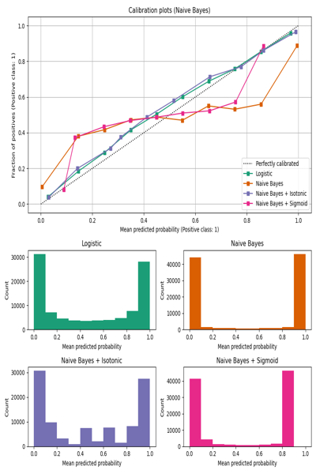
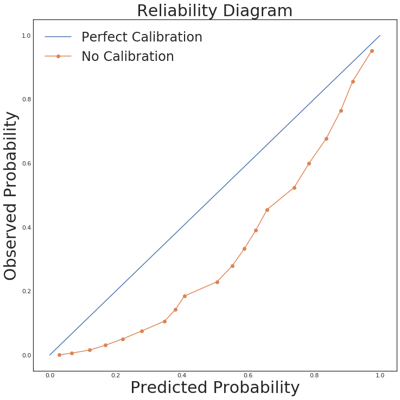

# Machine Learning Modeling

Tips and best practices for training and deploying (non-deep learning) models at scale. There is a heavy focus on systems.

## Target Engineering
* Censoring and truncation
* Log-transforming targets
* Binning and classification
* Smoothing
* Outlier handling

### Class separability

* Why NOT clustering

    1. **Geometry mismatch**:
    Clustering methods like k-means assume spherical or convex clusters. If the true class structure is non-convex or imbalanced, you’ll get misleadingly low agreement even for separable classes.

    2. **High-dimensional noise**:
    In high dimensions, unsupervised methods can easily “see” spurious structure. PCA or t-SNE preprocessing helps but can distort distances.

    3. **Supervised ≠ unsupervised separability**:
    There are plenty of problems where classes are separable only through conditional structure — e.g., “if feature A > 0.5, then separate by feature B; otherwise, not.”
    Clustering can’t discover such axis-conditional logic.

    4. **Choice of `k`**:
    You used `k=2`, but the method generalizes poorly to multiclass. And even for binary, if one class has multiple subclusters, k=2 underfits the true geometry.

* **Fisher’s Discriminant Ratio (FDR)**:
  
  $$J = \frac{(\mu_1 - \mu_2)^2}{\sigma_1^2 + \sigma_2^2}$$

Extended to multidimensional space, it measures class-wise between/within scatter.

* **Linear Discriminant Analysis (LDA)**: Maximizes the same ratio in the projected space — if the resulting eigenvalue spectrum is dominated by one or two large values, you’ve got clean separability.

* **Supervised cross-validated probe**: Train a simple linear classifier (e.g., logistic regression or linear SVM). If it achieves near-perfect performance, you’ve got separable classes; if not, the structure is entangled.

* In practice just train a simple model and evaluate its performance

## Feature Selection

* Constraint-based selection
* Wrapper methods (RFE, genetic algorithms)
* Embedded methods (Lasso, tree-based feature importance)
* Causal feature selection

## Feature Engineering

### Categorical Variables
*  high cardinality categorical variables
  - Target encoding with smoothing
  - Hashing trick
  - Embeddings (entity embeddings)
  - Frequency or count encoding
  - Group rare categories into "Other"
  - Leave-one-out encoding

* Sparse categorical variables

### User and item features

* User embeddings models
* Item embeddings models

### Scaling

* Standardization (z-score normalization). Good for algorithms that assume Gaussian distribution. 
* Min-Max Scaling. Scales features to a fixed range, usually [0, 1]. Useful for algorithms that require bounded input. Min-Max Scaling preserves zero entries in sparse data, whereas Standard Scaling can destroy this structure.
* Max Abs Scaling. Scales each feature by its maximum absolute value. Preserves sparsity.
* Robust Scaling. Uses median and interquartile range (IQR) for scaling. Effective when data contains outliers.
* Log Transformation. Useful for skewed distributions to reduce the impact of extreme values.

*If the dataset contains significant outliers, Standard Scaling is generally more resilient. Min-Max Scaling can squeeze the majority of your data into a very small range if an outlier is present.*

## Feature Importance and Interpretability

See all of Chris Molnar's work: https://christophm.github.io/interpretable-ml-book/

* SHAP values
* LIME
* Permutation importance

## Multi-class Classification
* One-vs-Rest (OvR)
* Multinomial Logistic Regression

### Evaluation
When you evaluate **precision, recall, and F-1** in a **multi-class** setting, you need a way to combine per-class scores into a single summary. Two common strategies are **micro-averaging** and **macro-averaging**. They differ in *how they treat the classes and the data samples*.

With **macro-averaging**, you compute the metric **separately for each class**, then take the **arithmetic mean** across classes. Practically, this means each class contributes equally to the final score, *regardless of how many samples are in that class*. Macro scores help you understand how the model performs *on average per class*, and they are useful when you care about performance fairness across classes rather than overall volume.

With **micro-averaging**, you **aggregate the confusion matrix counts** across all classes first (sum up true positives, false positives, and false negatives across every class) and then compute precision, recall, and F-1 from those totals. This treats **each individual sample equally**, so classes with more samples dominate the final score. Micro metrics are often close to overall accuracy in single-label multi-class classification because the aggregated counts reflect total classification performance.

So the key distinction is:

* **Macro**: average of class-wise metrics → each class weighted *equally*.
* **Micro**: metric from aggregated counts → each *sample* weighted equally, heavy weighting on frequent classes

In imbalanced datasets, macro scores highlight performance on smaller classes, while micro scores are more influenced by the largest class. You can choose based on whether per-class performance or overall performance matters more for your problem.([Evidently AI][3])

## Class Imbalance

### Techniques to Handle Class Imbalance
* Random Over-Sampling
  - Duplicates random samples from the minority class to balance the class distribution.
  - Simple but can lead to overfitting.
* Random Under-Sampling
  - Removes random samples from the majority class to balance the class distribution.
    - Can lead to loss of important information.
    - Useful when the majority class is significantly larger than the minority class.
* SMOTE: Synthetic Minority Over-sampling Technique
  - Generates synthetic samples for the minority class by interpolating between existing minority samples.
  - Useful for balancing datasets where one class is significantly underrepresented.
* ADASYN: Adaptive Synthetic Sampling
  - An extension of SMOTE that generates synthetic samples based on the density of the minority class.
  - Focuses on generating more samples in areas where the minority class is underrepresented.

### Effect on Model Evaluation
* Accuracy is not a reliable metric for imbalanced datasets.
* Precision, Recall, F1-Score, and AUC-ROC are more informative metrics.
* Confusion Matrix provides a detailed breakdown of true positives, false positives, true negatives, and false negatives.
* Use stratified sampling for train-test splits to maintain class distribution.
* Cross-validation should also be stratified to ensure each fold has a representative class distribution.

### Cost-Sensitive Learning
* Modify the learning algorithm to take into account the costs of misclassification.
* Consider using cost-sensitive learning where misclassification costs are higher for the minority class.
* Adjust decision thresholds to optimize for specific metrics (e.g., maximizing F1-score).
* Ensemble methods like Balanced Random Forests or EasyEnsemble can be effective for imbalanced datasets.
* Loss functions like focal loss can be used to focus learning on hard-to-classify examples.

### Best Practices
* Use of anomaly detection techniques when the minority class is extremely rare.

## Hyperparameter Tuning

* CV for hyperparameter tuning
* Grid Search
* Random Search
* Bayesian Optimization
* Hyperband, Hyperopt, Optuna

## Uncertainty Estimation

### Conformal prediction

* Xu and Xie, [Conformal prediction for time series](../readings/2010.09107v15.pdf)

* Bayesian methods

## Data Drift

* covariate drift
* model drift
* concept drift
* monitoring strategies

## Calibration

See https://iclr-blogposts.github.io/2025/blog/calibration/#evaluating-calibration-expected-calibration-error-ece and https://www.unofficialgoogledatascience.com/2021/04/why-model-calibration-matters-and-how.html

### Proper scoring rules
* Brier score: Measures the mean squared difference between predicted probabilities and actual outcomes. Lower values indicate better calibration.
$$
Brier\ Score = \frac{1}{N} \sum_{i=1}^{N} (y_i - \hat{p}_i)^2
$$
* Logarithmic loss (Log loss): Measures the performance of a classification model where the prediction is a probability value between 0 and 1. Lower values indicate better calibration. Often, properly regularized logistic regression is well calibrated by default thanks to the use of the log-loss function during training.
$$
Log\ Loss = -\frac{1}{N} \sum_{i=1}^{N} [y_i \log(\hat{p}_i) + (1 - y_i) \log(1 - \hat{p}_i)]
$$

### Calibration metrics

* Calibration plot/Reliability diagram: A graphical representation of the relationship between predicted probabilities and actual outcomes.

* Expected calibration error (ECE): A metric that quantifies the difference between predicted probabilities and actual outcomes.
$$
ECE = \sum_{m=1}^{M} \frac{|B_m|}{N} |acc(B_m) - conf(B_m)|
$$

  where $M$ is the number of bins, $B_m$ is the set of samples in bin $m$, $N$ is the total number of samples, $acc(B_m)$ is the accuracy of bin $m$, and $conf(B_m)$ is the average predicted probability of bin $m$.

  * Sensitive to number of bins
  
  * Vulnerable to classification to the majority class

### Calibrating classifiers

* Platt scaling: A method that fits a logistic regression model to the classifier's scores to produce calibrated probabilities.

* Isotonic regression: A non-parametric approach that fits a piecewise constant function to the classifier's scores to produce calibrated probabilities. It solves the minimization problem:
$$
\min_{f \in \mathcal{F}} \sum_{i=1}^{N} (y_i - f(\hat{p}_i))^2
$$
where $\mathcal{F}$ is the set of all non-decreasing functions, i.e., $f(x_1) \leq f(x_2)$ for $x_1 < x_2$, $\forall f \in \mathcal{F}$.

* Temperature scaling: A simple extension of Platt scaling that introduces a temperature parameter to adjust the confidence of the predictions.

## Model Selection

## Ensembling

## Case Studies and Articles

* https://mindfulmodeler.substack.com/p/how-to-get-from-evaluation-to-final

* https://www.uber.com/en-BE/blog/tuning-model-performance

* https://www.uber.com/en-BE/blog/elastic-xgboost-ray

* https://www.uber.com/en-BE/blog/optimal-feature-discovery-ml

* https://www.uber.com/en-BE/blog/productionizing-distributed-xgboost

* https://www.uber.com/en-BE/blog/simulated-marketplace

* https://netflixtechblog.medium.com/lessons-learnt-from-consolidating-ml-models-in-a-large-scale-recommendation-system-870c5ea5eb4a

* https://netflixtechblog.com/machine-learning-for-fraud-detection-in-streaming-services-b0b4ef3be3f6

* https://www.uber.com/en-BE/blog/manifold/