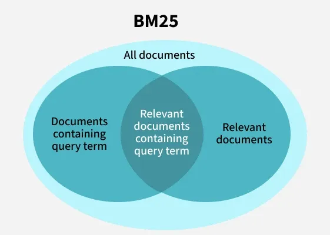
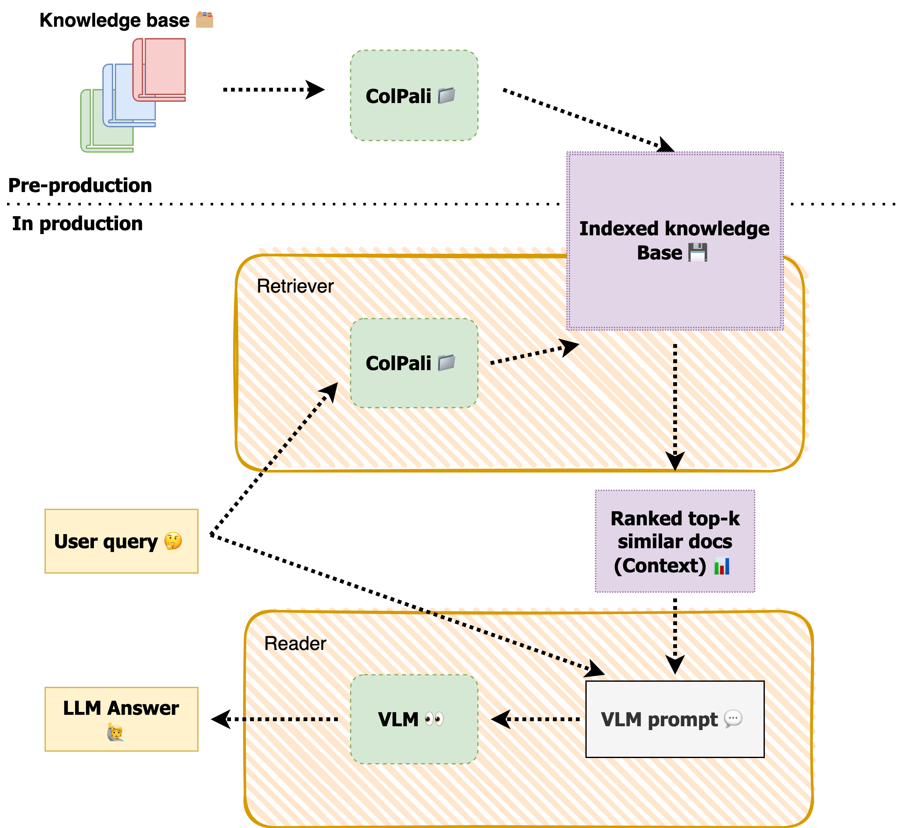
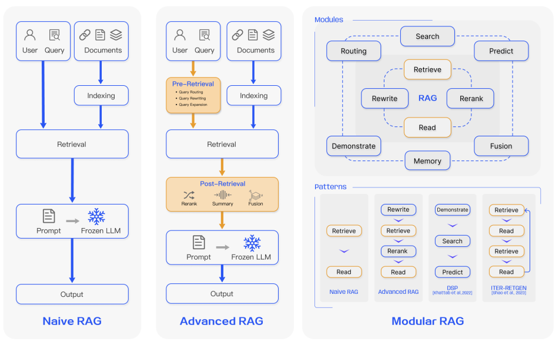
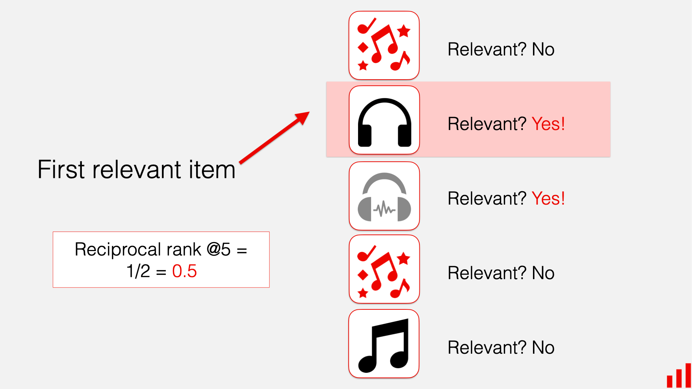
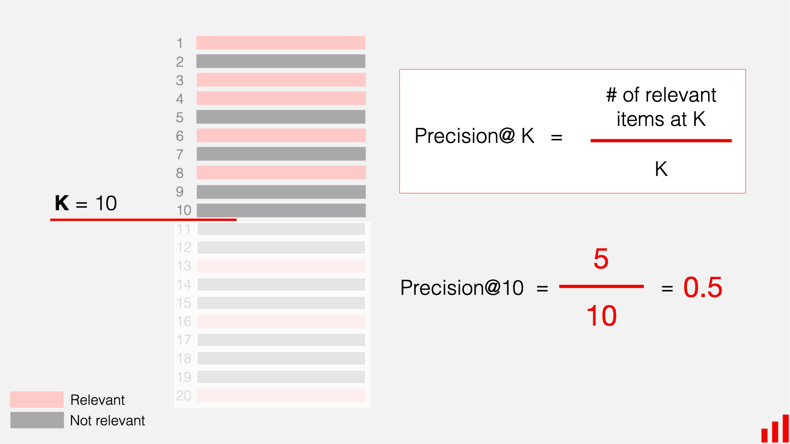
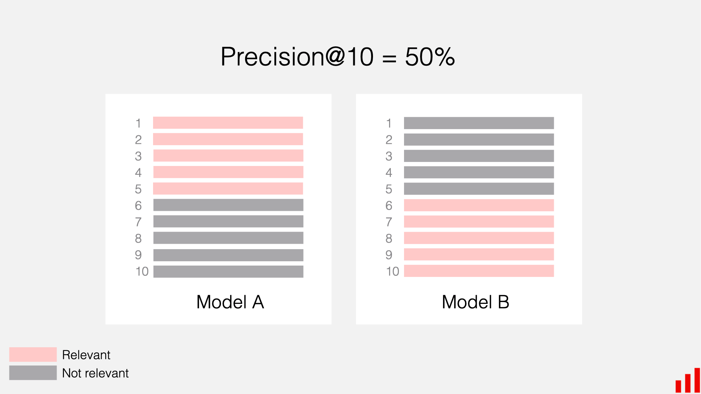
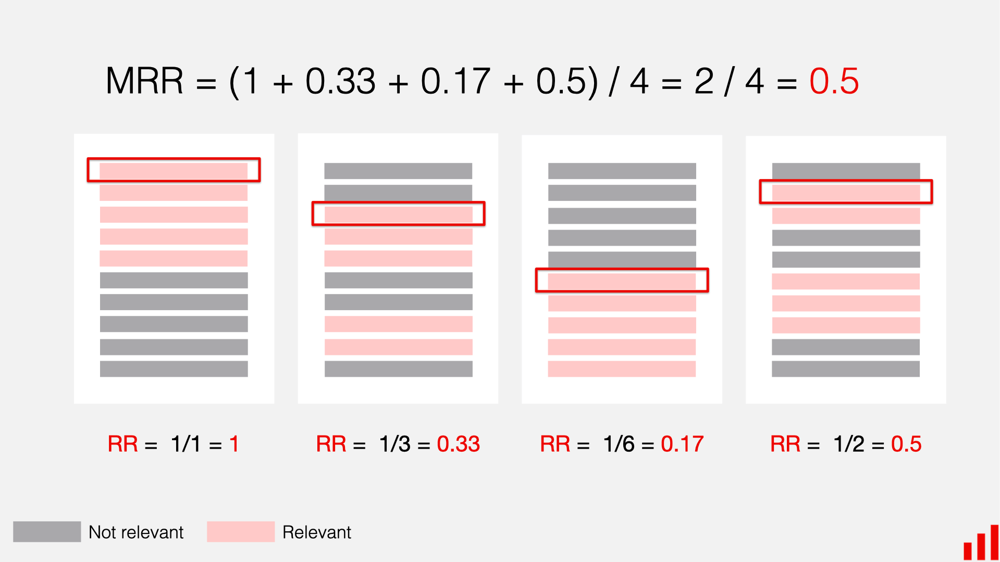
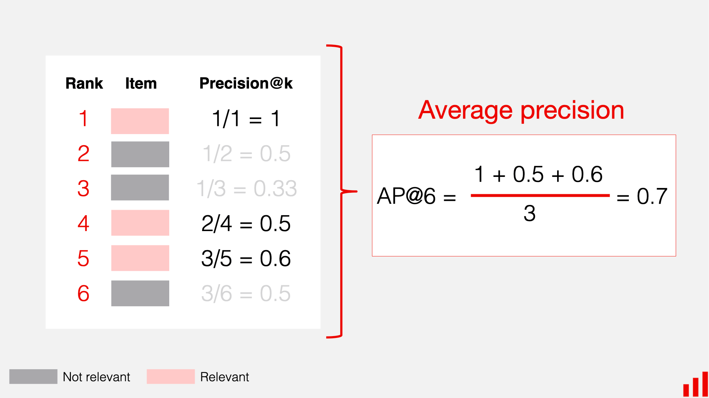
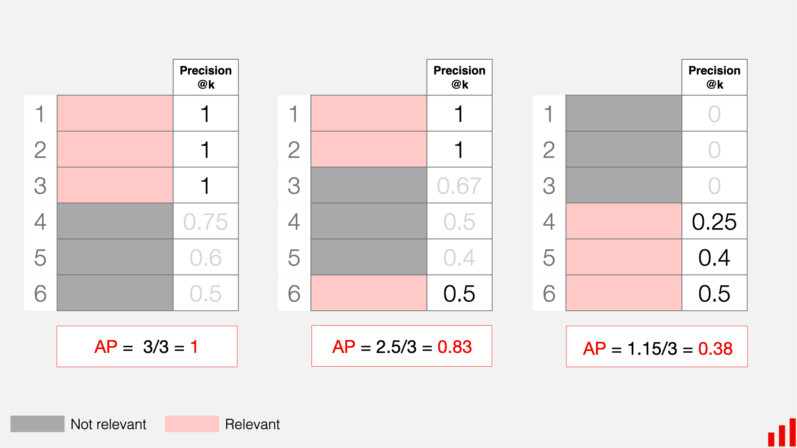

# Neural Information Retrieval

## Questions

### how to measure hallucinations

### how to evaluate outputs against benchmarks

### Desing a QA System

* Given a large dataset of question-answer pairs, how would you build an information retrieval system to efficiently retrieve relevant documents for a given question? How would you design the system to accurately retrieve and quote exact ansewers from the documents?

* How would you fine-tune a bi-encoder model for information retrieval tasks? What loss functions and training strategies would you use to improve retrieval accuracy?
    * `SentenceTransformers` has built-in methods for fine-tuning bi-encoders using contrastive loss or multiple negatives ranking loss.
    * You would typically use a dataset of query-document pairs, optimizing the model to bring relevant pairs closer in the embedding space while pushing irrelevant pairs apart.
    * Use hard negatives (difficult non-relevant documents) during training to improve the model's discriminative ability.
    * For loss functions, consider using contrastive loss or triplet loss.

* What are your thoughts on GraphRAG?

* How do long context windows impact RAG?
    * Context window is like RAM
    * can use longer documents without chunking
    * changes the retrieval overhead. With chunking, you have to retrieve multiple chunks and then rerank them, which adds latency. With longer context windows, you can retrieve fewer, larger documents, reducing the number of retrieval calls. For Recall@k, this means you might be able to use a smaller k since each retrieved document contains more information.

* Should the way in which you fine-tune your bi-encoder model affect the way you should fine-tune your cross-encoder reranker and vice versa? Why or why not?

* what's the best strategy when chunks or documents don't fit in context window?
    * Why do they not fit? Are they too long individually, or is it the total number of chunks?
    * What's the latency requirement?
    * Map documents to pre-generated summaries and pass those into the context window after retrieving the full document.

* How would you design a RAG system to return answers synthesized from multiple documents rather than just quoting a single document? What challenges would you face in ensuring the generated answers are accurate and coherent?
    * Use a fusion-in-decoder (FiD) architecture, where the retrieved documents are concatenated and fed into a seq2seq model like T5 or BART to generate a synthesized answer.
    * Challenges include ensuring the model accurately integrates information from multiple sources without introducing hallucinations, maintaining coherence in the generated text, and effectively handling conflicting information from different documents.
    * To properly attribute sources implement a citation mechanism via...


### Choosing among MRR, MAP, and NDCG

"You are tasked with defining the primary offline evaluation metric for three different systems: (1) A voice assistant answering factual questions like 'Who was the 16th US president?'. (2) An internal document search for a law firm where associates are looking for all relevant case precedents. (3) The main product recommendation carousel on an e-commerce homepage. Assign one of MRR, MAP, or NDCG to each system as its North Star metric and rigorously defend your choices by describing the user's goal in each scenario."

Ideal Answer:

The candidate must correctly map each scenario to the most appropriate metric and provide a robust justification rooted in user intent.

**1. Voice Assistant (Factual Questions): Mean Reciprocal Rank (MRR)**

* **Assignment:** MRR is the best choice.
* **Defense:** The user interaction with a voice assistant for a factual question is a "known-item seeking" or "navigational" task. There is typically one single, correct answer. The user's goal is to get this answer as quickly and with as little effort as possible. They are not interested in a list of semi-relevant documents. MRR perfectly captures this success criterion. It measures the reciprocal of the rank of the *first* correct answer.<sup>18</sup> An MRR of 1 means the correct answer was always the first result. An MRR of 0.5 means it was, on average, the second result. MRR completely ignores all results after the first correct one, which aligns perfectly with the user's behavior of disengaging once their question is answered.<sup>19</sup>

**2. Legal Document Search: Mean Average Precision (MAP)**

* **Assignment:** MAP is the most suitable metric.
* **Defense:** This is a classic information retrieval task. The user (a law associate) needs to find *all* or *many* relevant documents (case precedents). A single good result is not sufficient. The user is willing to scan a list of results, and their satisfaction depends on the density of relevant documents at the top of that list. MAP is designed for this. It calculates the average precision at each relevant document's position and then averages these scores across all queries.<sup>18</sup> This means it rewards models that not only find many relevant documents (high recall) but also rank them early in the list (high precision). It penalizes models that intersperse irrelevant documents among the relevant ones, which would increase the user's cognitive load. It assumes binary relevance (a document is either a precedent or it isn't), which is appropriate for this legal context.<sup>22</sup>

**3. E-commerce Homepage Recommendations: Normalized Discounted Cumulative Gain (NDCG)**

* **Assignment:** NDCG is the superior metric.
* **Defense:** The goal of a recommendation carousel is discovery and engagement, not finding a single correct item. Unlike the legal search, relevance is not binary. A product can be highly relevant, somewhat relevant, or irrelevant. For example, a camera that perfectly matches a user's past purchases is more relevant than a camera bag, which is in turn more relevant than a pair of shoes. NDCG is the only one of these three metrics that handles **graded relevance**.<sup>18</sup> Furthermore, user attention wanes as they scroll. NDCG incorporates a **logarithmic positional discount**, meaning a highly relevant item at position 1 contributes more to the score than the same item at position 5. This models user behavior more realistically than MAP's linear weighting. Finally, the 'N' in NDCG stands for **normalization**, which divides the score by the score of a perfect ranking. This allows for fair comparison across users who may have different numbers of relevant items, making it a robust metric for a diverse user base.<sup>22</sup>

**Common Mistakes and Misconceptions:**

* **Misassigning Metrics:** Confusing the use cases, for example, suggesting NDCG for the voice assistant or MRR for the e-commerce carousel.
* **Weak Justifications:** Correctly assigning the metrics but failing to articulate the underlying user behavior model for each one (e.g., "MRR is for when you want the first one right," without explaining *why* that's the user's goal).
* **Ignoring Key Features:** Failing to mention graded relevance or positional discounting for NDCG, or the focus on the first relevant item for MRR.

**Follow-up Questions:**

* "In the legal search scenario, what if some precedents are seminal and far more important than others? How might you adapt your evaluation beyond MAP?" (Probes the idea of extending MAP to a weighted version or transitioning to NDCG if relevance scores can be assigned).
* "MRR is simple and interpretable. What is its biggest weakness, and in what kind of search task would that weakness be most apparent?" (Its biggest weakness is ignoring all results after the first hit. This would be terrible for an exploratory search, like "ideas for a vacation in Italy," where the user wants a diverse set of high-quality options, not just one).


### The Power of Graded Relevance

This question focuses on the unique and powerful feature of NDCG, ensuring the candidate understands its mechanics and why it represents an advancement over simpler binary-relevance metrics.

Question:

"Explain how NDCG works, starting from Cumulative Gain. What specific limitation of a metric like MAP does NDCG's concept of 'graded relevance' solve? Provide a concrete example from e-commerce search where two ranked lists would receive the same MAP score but a deservedly different NDCG score."

Ideal Answer:

The candidate should build the explanation from the ground up.

**Part 1: The Mechanics of NDCG**

1. **Cumulative Gain (CG):** This is the most basic step. It's simply the sum of the relevance scores of the items in the top-k results. For binary relevance (0 or 1), it's just the count of relevant items. It ignores order. List and have the same CG if A, B, C have the same relevance scores.<sup>18</sup>
2. **Discounted Cumulative Gain (DCG):** This is the key innovation. It introduces a positional penalty. The relevance score of each item is divided by a logarithmic function of its rank (commonly ). This means a relevance score of 3 at position 1 is worth more than a relevance score of 3 at position 5. The formula is .<sup>18</sup>
3. **Normalized Discounted Cumulative Gain (NDCG):** DCG scores are not comparable across different queries, because some queries might have more highly relevant items than others. To solve this, we calculate the Ideal DCG (IDCG), which is the DCG of a perfect ranking where all items are sorted by relevance. We then normalize our model's DCG by the IDCG: . The result is a score between 0 and 1 that is comparable across queries.<sup>22</sup>

Part 2: The Limitation of MAP Solved by NDCG

"The primary limitation of MAP is that it operates on binary relevance. An item is either relevant (1) or not (0). It cannot distinguish between a 'perfect match' and a 'pretty good' match. In many real-world scenarios, especially in e-commerce or media, relevance is a spectrum. NDCG's use of graded relevance scores (e.g., 0 for irrelevant, 1 for a related item, 2 for a good match, 3 for a perfect match) directly solves this limitation. It allows the evaluation metric to capture the nuance of user satisfaction much more accurately."

Part 3: The E-commerce Example

"Suppose a user searches for 'Sony Alpha a7 IV camera'. We have two competing search algorithms that return the following top 3 results. The relevance scores are on a 0-3 scale (3=perfect, 2=good, 1=related, 0=irrelevant).

**Ground Truth Relevance:**

* Sony Alpha a7 IV Camera Body: **Relevance = 3**
* Sony Alpha a7 IV with Kit Lens: **Relevance = 2**
* SanDisk 128GB SD Card: **Relevance = 1**

**Algorithm A's Ranking:**

1. SanDisk 128GB SD Card (Relevance=1)
2. Sony Alpha a7 IV Camera Body (Relevance=3)
3. Sony Alpha a7 IV with Kit Lens (Relevance=2)

**Algorithm B's Ranking:**

1. Sony Alpha a7 IV with Kit Lens (Relevance=2)
2. Sony Alpha a7 IV Camera Body (Relevance=3)
3. SanDisk 128GB SD Card (Relevance=1)

MAP Score Calculation:

For MAP, all three items are 'relevant' (score > 0), so we treat them as binary 1s.

* **MAP for A:** Precision@1=1/1, Precision@2=2/2, Precision@3=3/3. Average Precision = .
* **MAP for B:** Precision@1=1/1, Precision@2=2/2, Precision@3=3/3. Average Precision = .
* **Result:** Both algorithms get a perfect MAP score of 1.0 because they returned all three relevant items in the top 3 positions. MAP fails to see any difference in quality.

**NDCG Score Calculation (simplified DCG):**

* **DCG for A:** 
* **DCG for B:** 
* **Ideal DCG (IDCG):** 
* **NDCG for A:** 
* **NDCG for B:** 
* **Result:** NDCG correctly identifies that Algorithm B is superior because it placed the more relevant items higher up in the ranking. It captures the nuance that MAP misses entirely."

**Common Mistakes and Misconceptions:**

* **Hand-waving the Math:** Being able to state that NDCG uses discounting and graded relevance but being unable to walk through the steps from CG to DCG to NDCG.
* **A Poor Example:** Providing an example where MAP and NDCG would agree, failing to construct a case that specifically highlights the unique value of graded relevance.
* **Forgetting Normalization:** Explaining DCG but failing to explain the importance of normalizing by IDCG to make scores comparable.

**Follow-up Questions:**

* "Where do the graded relevance scores come from in practice? How would you design a system to collect them?" (Probes practical knowledge of data collection, e.g., using explicit user ratings, implicit signals like clicks and purchases, or human relevance judgments from annotators).


## Vector Databases
* FAISS
* Pinecone
* Weaviate
* LanceDB (good for MVPs)
* Chroma
* scaNN
* Milvus
* Vespa

## Benchmarks
* MTEB
* RTEB
* BEIR

## Sentence Transformers

[SentenceTransformers 🤗](https://huggingface.co/sentence-transformers) and [Documentation](https://www.sbert.net/)

Sentence Transformers (a.k.a. SBERT) is the go-to Python module for accessing, using, and training state-of-the-art embedding and reranker models. It can be used to compute embeddings using Sentence Transformer models, to calculate similarity scores using Cross-Encoder (a.k.a. reranker) models, or to generate sparse embeddings using Sparse Encoder models. This unlocks a wide range of applications, including semantic search, semantic textual similarity, and paraphrase mining.

### Pre-trained Models
* Multilngual BERT (eg. `distiluse-base-multilingual-cased-v2`)
* MiniLM (eg. `all-MiniLM-L6-v2`)
* MPNet (eg. `all-mpnet-base-v2`)


### Encoding Usage

```python
from sentence_transformers import SentenceTransformer

# 1. Load a pretrained Sentence Transformer model
model = SentenceTransformer("all-MiniLM-L6-v2")

# The sentences to encode
sentences = [
    "The weather is lovely today.",
    "It's so sunny outside!",
    "He drove to the stadium.",
]

# 2. Calculate embeddings by calling model.encode()
embeddings = model.encode(sentences)
print(embeddings.shape)
# [3, 384]

# 3. Calculate the embedding similarities
similarities = model.similarity(embeddings, embeddings)
print(similarities)
# tensor([[1.0000, 0.6660, 0.1046],
#         [0.6660, 1.0000, 0.1411],
#     
```

### Reranking Usage

```python
from sentence_transformers import CrossEncoder

# 1. Load a pretrained CrossEncoder model
model = CrossEncoder("cross-encoder/ms-marco-MiniLM-L6-v2")

# The texts for which to predict similarity scores
query = "How many people live in Berlin?"
passages = [
    "Berlin had a population of 3,520,031 registered inhabitants in an area of 891.82 square kilometers.",
    "Berlin has a yearly total of about 135 million day visitors, making it one of the most-visited cities in the European Union.",
    "In 2013 around 600,000 Berliners were registered in one of the more than 2,300 sport and fitness clubs.",
]

# 2a. Either predict scores pairs of texts
scores = model.predict([(query, passage) for passage in passages])
print(scores)
# => [8.607139 5.506266 6.352977]

# 2b. Or rank a list of passages for a query
ranks = model.rank(query, passages, return_documents=True)

print("Query:", query)
for rank in ranks:
    print(f"- #{rank['corpus_id']} ({rank['score']:.2f}): {rank['text']}")
"""
Query: How many people live in Berlin?
- #0 (8.61): Berlin had a population of 3,520,031 registered inhabitants in an area of 891.82 square kilometers.
- #2 (6.35): In 2013 around 600,000 Berliners were registered in one of the more than 2,300 sport and fitness clubs.
- #1 (5.51): Berlin has a yearly total of about 135 million day visitors, making it one of the most-visited cities in the European Union.
"""
```

### Sparse Encoder Usage

```python
from sentence_transformers import SparseEncoder

# 1. Load a pretrained SparseEncoder model
model = SparseEncoder("naver/splade-cocondenser-ensembledistil")

# The sentences to encode
sentences = [
    "The weather is lovely today.",
    "It's so sunny outside!",
    "He drove to the stadium.",
]

# 2. Calculate sparse embeddings by calling model.encode()
embeddings = model.encode(sentences)
print(embeddings.shape)
# [3, 30522] - sparse representation with vocabulary size dimensions

# 3. Calculate the embedding similarities
similarities = model.similarity(embeddings, embeddings)
print(similarities)
# tensor([[   35.629,     9.154,     0.098],
#         [    9.154,    27.478,     0.019],
#         [    0.098,     0.019,    29.553]])

# 4. Check sparsity stats
stats = SparseEncoder.sparsity(embeddings)
print(f"Sparsity: {stats['sparsity_ratio']:.2%}")
# Sparsity: 99.84%
```

## Prompt and Context Engineering for RAG
* Chris Pott's *BetterTogether* paper showing prompt optimization can match or exceed SFT for specific tasks and *GEPA* for reflective prompt evolution > RL

```python
def question_answering(context, query):
    prompt = f"""
                Give the answer to the user query delimited by triple backticks ```{query}```\
                using the information given in context delimited by triple backticks ```{context}```.\

                If there is no relevant information in the provided context, try to answer yourself, 
                but tell user that you did not have any relevant context to base your answer on.
                Be concise and output the answer of size less than 80 tokens.
                """

    response = get_completion(instruction, prompt, model="gpt-3.5-turbo")
    answer = response.choices[0].message["content"]
    return answer
```

## Indexing and chunking strategies
* Text chunking methods (e.g., fixed-size, semantic segmentation)
* Embedding generation for chunks (e.g., using SentenceTransformers)
* Never cut off a sentence.
* Use overlapping text from previous and next chunks to provide context.

## Retriever models

* In general, don't use LLMs as encoders/retrievers. They are slow and expensive compared to dedicated retriever models.

### Metadata Filtering
* Use metadata (e.g., date, author, category) to filter documents before retrieval to improve relevance and efficiency.

* Entity detection models such as spaCy, GliNER (Zaratiana et al. 2023), or NER transformers can be used to extract entities from queries and documents for more precise filtering.

### TF-IDF

$$
TF(t, d) = \frac{f_{t,d}}{\sum_{t' \in d} f_{t',d}}
$$

where $f_{t,d}$ is the raw count of term $t$ in document $d$.

$$
IDF(t, D) = \log{\frac{N}{|\{d \in D: t \in d\}|}}
$$

where $N$ is the total number of documents in the corpus $D$, and the denominator counts how many documents contain term $t$.

The TF-IDF score for term $t$ in document $d$ is then computed as:

$$
TFIDF(t, d, D) = TF(t, d) \times IDF(t, D)
$$

### BM25

**Okapi Best Matching 25 Algorithm** (BM25) is a ranking algorithm used in information retrieval systems to determine how relevant a document is to a given search query. 

* BM25 is especially effective for keyword-based searches and scenarios where exact term matching is crucial. Great for longer documents and documents containing a lot of jargon (i.e., domain-specific terms). Super fast and efficient, $O(N)$ complexity.

* improved version of the traditional TF-IDF.

* measures term frequency and document relevance more accurately.

* accounts for document length normalization, giving fair weight to all documents.

* widely used in tools like Elasticsearch, Whoosh and Lucene.

* helps to deliver more relevant search results based on keyword matching and context.



The BM25 score for a document $D$ with respect to a query $Q$ is calculated as follows:
$$
\text{BM25}(D, Q) = \sum_{t \in Q} IDF(t) \cdot \frac{f(t, D) \cdot (k_1 + 1)}{f(t, D) + k_1 \cdot (1 - b + b \cdot \frac{|D|}{\text{avgdl}})}
$$

Where:
* $f(t, D)$ is the term frequency of term $t$ in document $D$.
* $|D|$ is the length of document $D$ in terms of number of words.
* $\text{avgdl}$ is the average document length in the corpus.
* $k_1$ and $b$ are hyperparameters that control term frequency saturation and document length normalization, respectively.

#### BM25 vs Dense Retrieval
| Aspect | BM25 (Sparse/Term-based)	| Dense/Embedding-based Retrieval |
|--------|------------------------------|-------------------------------|
| Representation | Term / lexical features (inverted index)	| Dense vector embeddings (semantic features) |
| Semantic matching | Exact term or near‐term matches | Captures synonyms, paraphrases, conceptual similarity |
| Computation cost | Low (inverted index lookups) | Higher (embedding generation, similarity search, GPU usage) |
| Interpretability | High — scoring formula transparent | Often lower — model internal weights less interpretable |
| Storage / indexing | Sparse index structure, efficient | Requires storing high-dimensional vectors, approximate nearest-neighbour (ANN) structures |
| Hybrid usage | Often used for first‐stage retrieval | Often used for re‐ranking or full retrieval in semantic tasks |

#### Advantages
* Robust and reliable: Works well across many datasets and retrieval tasks.
* Efficient and scalable: Computationally simpler than many neural retrieval methods making it practical for large‐scale search.
* Tunable: k1​ and b parameters allow adaptation to domain or document‐type characteristics.
* Interpretable: Because it is based on well‐understood statistical components, it is easier to debug and understand compared to many “black-box” models.

#### Limitations
* Lexical only: It matches terms, not concepts so synonyms, paraphrases, semantic relatedness are not captured.
* No user personalization or context awareness: The model does not incorporate user signals, query history or implicit context by default.
* Corpus characteristics matter: The effect of document length, term distribution and corpus size can influence performance significantly.
* Does not use dense embeddings: Cannot capture more abstract semantic relationships the way embedding‐based/dense retrieval methods can.


### Sparse Methods
* Learned Sparse Encoders (e.g., SPLADE) generate high-dimensional sparse representations that capture term importance and semantic relevance, improving retrieval performance while maintaining efficiency.
* very strong in-domain

### Hybrid retrievers (BM25 + dense)

* Combining BM25 with dense retrieval models (e.g., dual-encoder).

* Dense retrievers: Capture semantic meaning but may miss exact keyword matches

* Sparse retrievers: Excel at precise term matching but lack semantic understanding

* Reciprocal rank fusion (RRF), is a scoring rerank technique that merges ranked lists from multiple retrieval systems, particularly the hybrid search approach. Instead of relying on raw scores, it aggregates based purely on document ranks, giving more weight to top-ranked items while still considering the lower ones. The constant k (typically 60) ensures that extreme rank variations don’t dominate.
$$
RRF(d) = \sum_{i=1}^{n} \frac{1}{k + rank_i(d)}
$$
where $rank_i(d)$ is the rank of document $d$ in the $i^{th}$ retrieval method, and $k$ is a constant (commonly set to 60).

### Bi-encoders

Bi-encoders (or dual-encoders) encode queries and documents separately into fixed-size embeddings, allowing for efficient similarity computation (e.g., cosine similarity) between them. This is suitable for large-scale retrieval but may miss nuanced interactions. Your queries are entirely unaware of your documents and your documents are entirely unaware of your queries.

Fine-tuning bi-encoders typically involves training on pairs of related queries and documents, optimizing a similarity metric (e.g., contrastive loss) to bring relevant pairs closer in the embedding space while pushing irrelevant pairs apart. This can be done using datasets like MS MARCO or Natural Questions.

Always fine-tune if you can.

### ColBERT

ColBERT (Contextualized Late Interaction over BERT) is a retrieval model designed to improve the balance between accuracy and efficiency in tasks like document retrieval or question answering. Unlike standard bi-encoder approaches, which encode queries and documents into fixed-dimensional vectors and compute a single similarity score, ColBERT introduces a “late interaction” mechanism. This allows the model to compare individual token-level embeddings from the query and document, capturing finer-grained semantic relationships. The key difference lies in how interactions between queries and documents are handled: bi-encoders compute similarity once after encoding, while ColBERT delays interaction until after encoding, enabling more nuanced comparisons without excessive computational cost.

Standard bi-encoders, such as those using BERT, process queries and documents independently. For example, a query like “How to bake a cake” and a document titled “Easy dessert recipes” would each be converted into a single vector. The similarity between these vectors (e.g., via dot product) determines relevance. While efficient—since document embeddings can be precomputed—this approach risks losing context. Specific terms like “bake” or “cake” might not align well if the document focuses on “oven temperatures” or “frosting techniques” but uses different phrasing. Bi-encoders rely on the encoder to compress all semantic information into one vector, which can oversimplify complex relationships. ColBERT addresses this by generating multiple embeddings per token. Each token in the query (e.g., “bake,” “cake”) is compared to every token in the document, and the model aggregates the maximum similarities across these token pairs. This allows ColBERT to recognize that “bake” aligns with “oven” and “cake” with “recipe,” even if the document doesn’t use the exact query terms.

ColBERT maintains efficiency by leveraging precomputed document token embeddings, similar to bi-encoders, but processes queries dynamically. For instance, during retrieval, a document’s token embeddings are stored in advance, while the query’s embeddings are generated on the fly. The late interaction step—calculating per-token similarities—adds computational overhead compared to bi-encoders but remains far cheaper than cross-encoders (which process query-document pairs jointly). This makes ColBERT suitable for large-scale applications where bi-encoders might miss nuanced matches. For example, a search for “car maintenance” could retrieve a document discussing “automobile care” by matching “car” to “automobile” and “maintenance” to “care” at the token level, even if the overall document vector isn’t close to the query vector in a bi-encoder setup. By balancing granularity and scalability, ColBERT offers a middle ground for developers needing higher accuracy without sacrificing precomputation benefits.

Very strong out-of-domain.

More robust to different chunking strategies because it compares at the token level.


## Similarity Search
* cosine similarity
* Indexing via
    * KD-Trees
    * HNSW
* k-NN Search
* Approximate Nearest Neighbors (ANN)
* binary quantization

## Reranker models

* SentenceTransformers, RankGPT, RankLLM, T5-based rankers, ColBERT-based rerankers. Leverage a powerful but computationally expensive model to re-evaluate and rank a smaller subset of candidate documents previously retrieved by the initial retriever.

### Cross-encoders

A reranker typically uses a cross-encoder model, which evaluates a query-document pair and generates a similarity score. This method is more powerful than *bi-enoders/dual-encoders* because it allows both the query and the document to provide context for each other. It’s like introducing two people and letting them have a conversation, rather than trying to match them based on separate descriptions. Cross-encoders jointly process query-document pairs, allowing for rich interactions and context sharing. This typically yields higher accuracy but is computationally expensive, making it less suitable for large-scale retrieval. It is effectively a binary classifier for which the probability of being in the positive class is taken as the relevance or similarity score. Very ineffecient.

Fine-tuning cross-encoders involves training on labeled query-document pairs, optimizing a classification loss (e.g., binary cross-entropy) to distinguish relevant from non-relevant documents. Datasets like MS MARCO or TREC can be used for this purpose.

### Late interaction models

like ColBERT, combine aspects of both. They encode queries and documents separately but allow for token-level interactions after encoding. This balances efficiency and accuracy by capturing finer-grained relationships without the full computational cost of cross-encoders.


* T5-based rankers

* ColBERT-based rerankers

* Semantic textual similarity

## Generation

## Multimodal RAG





* Multimodal Embeddings
    * CLIP
    * DINOv3
    * Qwen-VL

## Hallucination Detection

* LLM-based judges

* BERTScore
    * BERTScore computes similarity between generated text and reference text using contextual embeddings from BERT. Higher scores indicate better alignment.

* BLEU
    * BLEU measures n-gram overlap between generated text and reference text. It’s precision-focused, so it checks how much of the generated text matches the reference.

* ROUGE
    * ROUGE measures n-gram recall between generated text and reference text. It’s recall-focused, so it checks how much of the reference text is covered by the generated text.

* Fact-based metrics

    * FactCC: A model trained to classify whether a generated statement is factually consistent with a source document.

    * QAGS: Uses question generation and answering to assess factual consistency.

* Farquhar, et al. 2024 Nature paper "Detecting hallucinations in large language models using semantic entropy" *develop new methods grounded in statistics, proposing entropy-based uncertainty estimators for LLMs to detect a subset of hallucinations—confabulations—which are arbitrary and incorrect generations. Our method addresses the fact that one idea can be expressed in many ways by computing uncertainty at the level of meaning rather than specific sequences of words. Our method works across datasets and tasks without a priori knowledge of the task, requires no task-specific data and robustly generalizes to new tasks not seen before.*
    * Generation: Sampling multiple answers from the LLM for a given input.

    * Clustering: Grouping these answers based on semantic equivalence using *bidirectional entailment*, which checks if two answers logically imply each other and share the same meaning $\rightarrow$ *semantic clusters*.
    * Entropy Calculation: Computing the semantic entropy by summing the probabilities of answers within the same semantic cluster. $\rightarrow$ High semantic entropy indicates high uncertainty in the meaning of the generated answers, signaling potential hallucinations.

## Fine-Tuning RAG Systems

### SFT
* Supervised Fine-Tuning (SFT) uses labeled datasets to fine-tune LLM

* In 🤗, use `Trainer` with a dataset of input-output pairs.

```python
from transformers import Trainer, TrainingArguments
training_args = TrainingArguments(
    output_dir="./results",
    num_train_epochs=3,
    per_device_train_batch_size=4,
    per_device_eval_batch_size=4,
    evaluation_strategy="epoch",
    save_strategy="epoch",
)
trainer = Trainer(
    model=model,
    args=training_args,
    train_dataset=train_dataset,
    eval_dataset=eval_dataset,
)
trainer.train()
```

### PEFT
* Parameter-Efficient Fine-Tuning (PEFT) techniques like LoRA and adapters allow fine-tuning with fewer trainable parameters, reducing computational 
costs.

### LoRA
* Low-Rank Adaptation (LoRA) injects low-rank matrices into transformer layers to adapt pre-trained models with minimal parameter updates.
* LoRA makes fine-tuning more efficient by drastically reducing the number of trainable parameters.
* The original pre-trained weights are kept frozen, which means you can have multiple lightweight and portable LoRA models for various downstream tasks built on top of them.
* LoRA is orthogonal to many other parameter-efficient methods and can be combined with many of them.
* Performance of models fine-tuned using LoRA is comparable to the performance of fully fine-tuned models.
* LoRA does not add any inference latency because adapter weights can be merged with the base model.

**NB U:** While LoRA is significantly smaller and faster to train, you may encounter latency issues during inference due to separately loading the base model and the LoRA model. To eliminate latency, use the [`merge_and_unload()`](https://huggingface.co/docs/peft/main/en/package_reference/lora#peft.LoraModel.merge_and_unload) function to merge the adapter weights with the base model which allows you to effectively use the newly merged model as a standalone model.

**NB D:** When quantizing the base model, e.g. for QLoRA training, consider using the [LoftQ initialization](https://arxiv.org/abs/2310.08659), which has been shown to improve the performance with quantization. The idea is that the LoRA weights are initialized such that the quantization error is minimized. To use this option, do not quantize the base model.


### DPO

* Direct Preference Optimization (DPO) fine-tunes LLMs directly on preference data without requiring a reward model. 

* Optimizes the model to increase the likelihood of preferred outputs over non-preferred ones based on human feedback.

**Training Recipe for DPO**
1. Collect preference data: pairs of preferred and non-preferred outputs for given inputs.

2. Define the DPO loss function:

    $L_{DPO} = -\log \sigma\left(\frac{1}{\tau}(s_{\theta}(x, y^+) - s_{\theta}(x, y^-))\right)$, where

* $s_{\theta}(x, y)$ is the model score for 
* input-output pair $(x, y)$
* $y^+$ is the preferred output
* $y^-$ is the non-preferred output
* $\sigma$ is the sigmoid function
* $\tau$ is a temperature hyperparameter.

3. Fine-tune the model using gradient descent to minimize the DPO loss over the preference dataset.

4. Evaluate the fine-tuned model on held-out preference data to ensure it aligns with human preferences.

### Tools and Libraries
* [🤗 TRL](https://🤗.co/docs/trl/index)


## Metrics
* Time to First Token (TTFT)
* Cost per 1K tokens/query
* Answer relevance
* Hallucination rate

## Personalization for RAG Systems
* User embeddings
* Contextual prompts
* Adaptive response generation

## Evaluation
* log-probability scoring of reference answers (judgment lists)
* human evaluation frameworks

Evaluating ranking systems requires a distinct set of metrics that go beyond simple classification accuracy. They must account for the position of items in a list and often the degree of relevance. This section tests a candidate's ability to select the right metric for the right user intent.

* Be aware of offline vs online metrics

* **Judgment lists** are used in offline evaluation. Judgment lists are made up of query-document pairs, each of which is assigned a “relevance grade.” (Here, “document” refers to a search result.) These relevance grades are made from “click models.” One of the simplest click models you can use centers around Click-Through-Rate, or “CTR.” The gist of a CTR click model is that each query-document’s relevance grade is based on its CTR. Normally, you assign relevance grades on a 0-4 scale, where higher is better.

### rank@k

* Rank@k measures the proportion of relevant documents in the top k results.




### Precision@k

* Precision@k measures the proportion of relevant documents in the top k results.



only considers the presence of the relevant items but does not take into account their order. Regardless of whether the 5 relevant items take positions 1 through 5 or 6 through 10, the Precision will be the same. 


### Mean Reciprocal Rank (MRR)

* reciprocal rank 

$$
RR = \frac{1}{\text{rank of first relevant document}}
$$

* Mean Reciprocal Rank (MRR) 
    * MRR equals 1 when the first recommendation is always relevant.
    * MRR equals 0 when there are no relevant recommendations in top k results.
    * MRR is sensitive to the position of the first relevant document; higher ranks contribute more to the score.

$$
MRR = \frac{1}{|Q|} \sum_{i=1}^{|Q|} \frac{1}{\text{rank}_i}
$$

* MRR is excellent for scenarios with a single correct answer. MRR is often relevant for information retrieval tasks. By looking at MRR, you can quickly grasp how close the correct answer is to the top of the average list. This metric might be less beneficial for applications with many relevant items, such as e-commerce recommendations where users might be interested in a wide range of products.

* MRR is easily interpretable. MRR is easy to explain and communicate to product and business stakeholders. It tells us how fast a usual user can find a relevant item.

* MRR disregards the relevance of items beyond the first one. MRR cares about the top relevant item, and this item only. It ignores all other ranks. The Reciprocal Rank will be the same even if no relevant items appear in the top K after the first one. If you want to assess it, you need other metrics beyond MRR.



### Mean Average Precision (MAP)

* Average Precision (AP) for a single query is the average of the precision values at the ranks where relevant documents are found.

$$
AP = \frac{1}{R} \sum_{k=1}^{N} P(k) \cdot rel(k)
$$

Where $R$ is the total number of relevant documents for the query.





* Mean Average Precision (MAP) is the mean of the Average Precision scores across all queries.

$$
MAP = \frac{1}{|Q|} \sum_{i=1}^{|Q|} AP_i
$$

where $|Q|$ is the total number of queries.

* MAP considers all relevant documents, rewarding systems that retrieve many relevant items and rank them highly.

* MAP is suitable for scenarios where users want to find multiple relevant items, such as legal document search or academic literature review.

* Pros
    * The strongest “pro” or MAP is its sensitivity to rank. Remember the usual Precision and Recall we keep bringing up? They return a single number at a specific K and only consider whether the relevant items are present. In contrast, MAP evaluates how well the system ranks the items, placing the relevant ones on top.
    * Focus on getting the top results right. MAP heavily penalizes the system for early errors. If getting the top predictions right is essential, MAP is a valuable metric to consider. This makes it a popular choice for information retrieval tasks, where you want users to be able to find the relevant document quickly.
* Cons
    * Binary relevance limitation. MAP assumes binary relevance (an item is either relevant or not). It does not account for varying degrees of relevance, which can be a limitation in scenarios where relevance is graded (e.g., highly relevant, somewhat relevant, irrelevant).
    * the exact values of MAP might still be hard to interpret, especially when communicating to business stakeholders, compared to more straightforward Precision and Recall, or even MRR.

### Cumulative Gain, Normalized Discounted Cumulative Gain (NDCG), Discounted Cumulative Gain (DCG)

* Cumulative Gain (CG) is the total gain (relevance) of all results in a ranked list up to position k. It is simply the sum of the relevance scores of the results.

$$
CG_k = \sum_{i=1}^{k} rel_i
$$

Where $rel_i$ is the relevance score of the result at position i.

* Discounted Cumulative Gain (DCG) introduces a positional discount to the relevance scores, reflecting the idea that users are more likely to pay attention to higher-ranked results. The discount is typically logarithmic, meaning that the relevance of a result at position i is divided by log2(i + 1). This means that a relevant document at position 1 contributes more to the DCG than the same document at position 5.

$$
DCG_k = \sum_{i=1}^{k} \frac{rel_i}{\log_2(i + 1)}
$$

* Normalized Discounted Cumulative Gain (nDCG) normalizes the DCG score by dividing it by the Ideal DCG (IDCG), which is the DCG score of a perfect ranking where all relevant documents are at the top. This normalization allows for comparison across different queries with varying numbers of relevant documents.
    * Its strength is its ability to measure graded relevance (i.e., using some scores for relevance), rather than binary relevance. 
    * In search, nDCG allows you to measure how far up a results page your most relevant search results are. 

$$
nDCG_k = \frac{DCG_k}{IDCG_k}
$$

Where $IDCG_k$ is the DCG of the ideal ranking up to position k.

### Diversity Metrics

* Intra-list diversity: Measures how diverse the items in a recommendation list are.
* Coverage: Proportion of the item catalog that is recommended across all users.


### A/B testing for retrieval/ranking models
* Click-through rate (CTR). With a CTR click model, each query-document pair’s relevance grade is based on how good its individual CTR is compared to the best CTR across all posts for that search query.


## How to Sytematically Monitor and Improve RAG Systems

## Synthetic Data and Training

## Safety and Ethics
* Toxicity detection
* Bias mitigation


## References
* [Ask in Any Modality: A Comprehensive Survey on Multimodal Retrieval-Augmented Generation](https://arxiv.org/abs/2502.08826)

* https://wandb.ai/site/articles/rag-techniques/

* https://aws.amazon.com/blogs/machine-learning/detect-hallucinations-for-rag-based-systems/

* https://lilianweng.github.io/posts/2021-03-21-lm-toxicity/

* https://huggingface.co/docs/peft/main/en/conceptual_guides/lora

* [Hu et al. (2021) LoRA: Low-Rank Adaptation of Large Language Models](https://arxiv.org/abs/2106.09685)

* Background: [https://web.stanford.edu/~jurafsky/slp3/11.pdf](https://web.stanford.edu/~jurafsky/slp3/11.pdf)

* [Improving document retrieval with sparse semantic encoders - OpenSearch](https://opensearch.org/blog/improving-document-retrieval-with-sparse-semantic-encoders/)

* [https://opensearch.org/blog/semantic-science-benchmarks/?ajs_aid=dab1969c-ad17-42c4-9cef-f91907757d5e](https://opensearch.org/blog/semantic-science-benchmarks/?ajs_aid=dab1969c-ad17-42c4-9cef-f91907757d5e) 

* [Neural sparse search - OpenSearch Documentation](https://docs.opensearch.org/latest/vector-search/ai-search/neural-sparse-search/) 

* [Integrate sparse and dense vectors to enhance knowledge retrieval in RAG using Amazon OpenSearch Service | AWS Big Data Blog](https://aws.amazon.com/blogs/big-data/integrate-sparse-and-dense-vectors-to-enhance-knowledge-retrieval-in-rag-using-amazon-opensearch-service/)

* [Enhancing Information Retrieval with Sparse Embeddings | Zilliz Learn](https://zilliz.com/learn/enhancing-information-retrieval-learned-sparse-embeddings)

* [https://jina.ai/news](https://jina.ai/news), in general, but see [Jina-CLIP-v1: A Truly Multimodal embeddings model for text and image](https://jina.ai/news/jina-clip-v1-a-truly-multimodal-embeddings-model-for-text-and-image/)

* Elastic search labs, in general, but see [https://www.elastic.co/search-labs/blog/openai-clip-alternatives](https://www.elastic.co/search-labs/blog/openai-clip-alternatives) 

* [https://huggingface.co/blog/rteb](https://huggingface.co/blog/rteb)

* [https://huggingface.co/mteb](https://huggingface.co/mteb)

* [https://arxiv.org/abs/2401.04055](https://arxiv.org/abs/2401.04055)

* [Stanford XCS224U: NLU I Information Retrieval, Part 4: Neural IR I Spring 2023](https://www.youtube.com/watch?v=EDVqG86AT0Q)

* [Stanford XCS224U: NLU I Information Retrieval, Part 2: Classical IR I Spring 2023](https://www.youtube.com/watch?v=D3yL63aYNMQ&list=PLoROMvodv4rOwvldxftJTmoR3kRcWkJBp&index=17)

* [Stanford XCS224U: NLU I Information Retrieval, Part 3: IR metrics I Spring 2023](https://www.youtube.com/watch?v=9YCb-IxtbFQ&list=PLoROMvodv4rOwvldxftJTmoR3kRcWkJBp&index=18)

* [Stanford XCS224U: NLU I Information Retrieval, Part 4: Neural IR I Spring 2023](https://www.youtube.com/watch?v=EDVqG86AT0Q&list=PLoROMvodv4rOwvldxftJTmoR3kRcWkJBp&index=19)

* [Stanford XCS224U: NLU I Information Retrieval, Part 5: Datasets and Conclusion I Spring 2023](https://www.youtube.com/watch?v=Bqps-t-U9jw&list=PLoROMvodv4rOwvldxftJTmoR3kRcWkJBp&index=20)

* [Beyond the Basics of Retrieval for Augmenting Generation (w/ Ben Clavié)](https://www.youtube.com/watch?v=0nA5QG3087g)

* https://www.reddit.com/r/RedditEng/comments/y6idrl/measuring_search_relevance_part_2_ndcg_deep_dive/

* https://www.evidentlyai.com/ranking-metrics/ndcg-metric

* https://www.evidentlyai.com/ranking-metrics/mean-reciprocal-rank-mrr

* https://en.wikipedia.org/wiki/Discounted_cumulative_gain

* https://www.reddit.com/r/RedditEng/comments/191nhka/bringing_learning_to_rank_to_reddit_search_goals/

* https://www.reddit.com/r/RedditEng/comments/1ft1tkw/bringing_learning_to_rank_to_reddit_ltr_modeling/

* https://www.reddit.com/r/RedditEng/comments/15lkrd2/first_pass_ranker_and_ad_retrieval/

* https://www.evidentlyai.com/ranking-metrics/mean-average-precision-map

* https://wandb.ai/ai-team-articles/finance-agentic-rag/reports/Building-a-financial-agentic-RAG-pipeline-Part-1---VmlldzoxNTAwNDkzMQ

* https://careersatdoordash.com/blog/open-source-search-indexing/

* https://careersatdoordash.com/blog/integrating-a-scoring-framework-into-a-prediction-service/